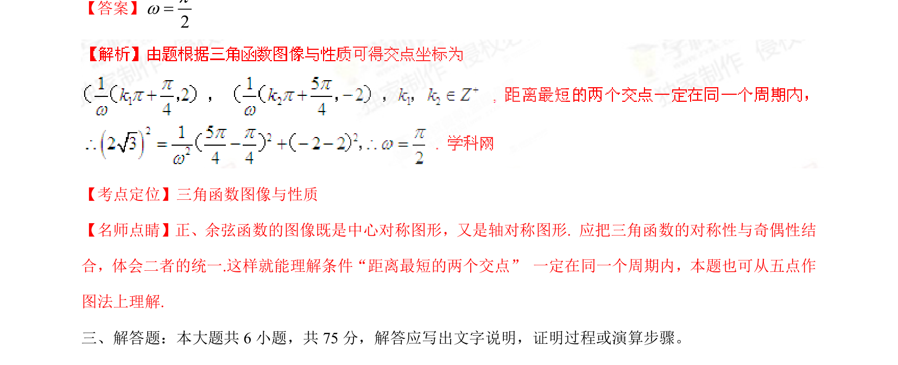

## 题面

## 摘要

考查正弦函数与余弦函数图像交点距离问题，利用对称性求参数ω。

## 关联考点

- [[三角函数图像与性质]]
- [[310-正弦函数图象与性质|正弦函数]]
- [[276-余弦函数图象与性质|余弦函数]]
- [[834-对称性|对称性]]

## 答案与解析

> 📄 原 PDF 第 10 页：`素材/真题/湖南/2008-2024·（湖南）数学高考真题/2015年高考数学试卷（文）（湖南）（解析卷）.pdf`
