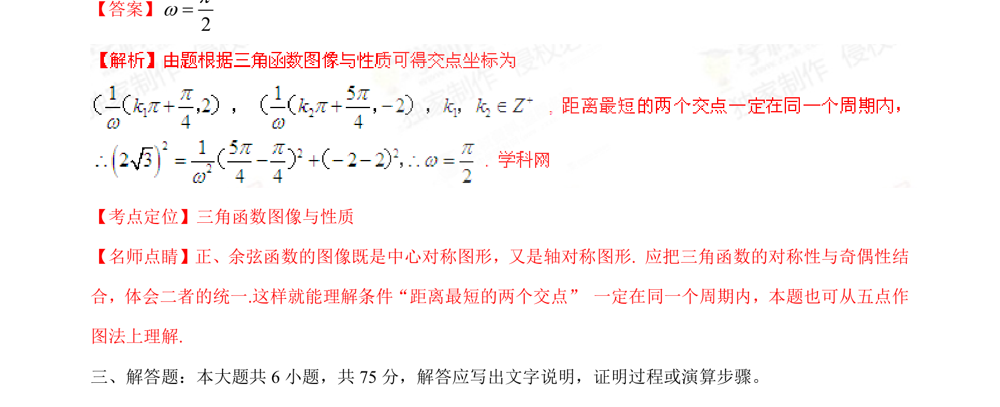

## 题面

## 摘要

考查正弦函数与余弦函数图像交点距离问题，利用对称性求参数ω。

## 关联考点

- [[三角函数图像与性质]]
- [[310-正弦函数图象与性质|正弦函数]]
- [[276-余弦函数图象与性质|余弦函数]]
- [[834-对称性|对称性]]

## 答案与解析

> 📄 原 PDF 第 10 页：`素材/真题/湖南/2008-2024·（湖南）数学高考真题/2015年高考数学试卷（文）（湖南）（解析卷）.pdf`

<!-- 题干文本-start -->
## 题干文本
15、已知>0,在函数y=2sin x与y=2cos x的图像的交点中，距离最短的两个交点的距离为2，则
 =_____.
<!-- 题干文本-end -->

<!-- 解析文本-start -->
## 解析文本
【答案】 
【考点定位】三角函数图像与性质
【名师点睛】正、余弦函数的图像既是中心对称图形，又是轴对称图形. 应把三角函数的对称性与奇偶性结
合，体会二者的统一.这样就能理解条件“距离最短的两个交点” 一定在同一个周期内，本题也可从五点作
图法上理解.
三、解答题：本大题共6小题，共75分，解答应写出文字说明，证明过程或演算步骤。
<!-- 解析文本-end -->
