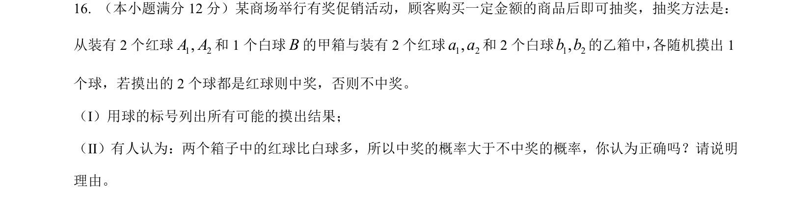
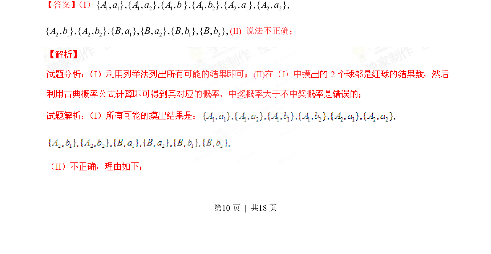
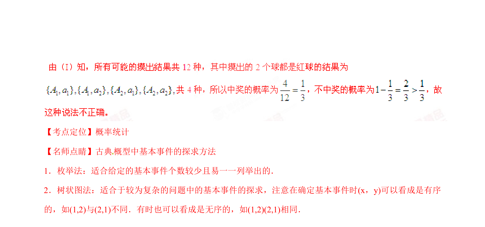

## 题面

## 摘要

通过摸球实验列举所有可能结果并判断概率说法的正确性

## 关联考点

- [[320-古典概型|古典概型]]
- [[列举法求概率]]

## 答案与解析

> 📄 原 PDF 第 10 页：`素材/真题/湖南/2008-2024·（湖南）数学高考真题/2015年高考数学试卷（文）（湖南）（解析卷）.pdf`

<!-- 题干文本-start -->
## 题干文本
16. （本小题满分12分）某商场举行有奖促销活动，顾客购买一定金额的商品后即可抽奖，抽奖方法是：
从装有2个红球 和1个白球 的甲箱与装有2个红球 和2个白球 的乙箱中， 各随机摸出1
个球，若摸出的2个球都是红球则中奖，否则不中奖。
（I）用球的标号列出所有可能的摸出结果；
（II）有人认为：两个箱子中的红球比白球多，所以中奖的概率大于不中奖的概率，你认为正确吗？请说明
理由。
<!-- 题干文本-end -->

<!-- 解析文本-start -->
## 解析文本
【答案】 （I） 
(II) 说法不正确；
www3w2pw=
1 2,A AB1 2,a a1 2,b b1 1 1 2 1 1 1 2 2 1 2 2{ , },{ , },{ , },{ , },{ , },{ , },A a A a A b A b A a A a2 1 2 2 1 2 1 2{ , },{ , },{ , },{ , },{ , },{ , },A b A b B a B a B b B b
<!-- 解析文本-end -->
