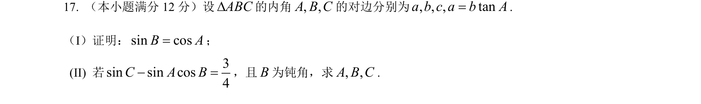
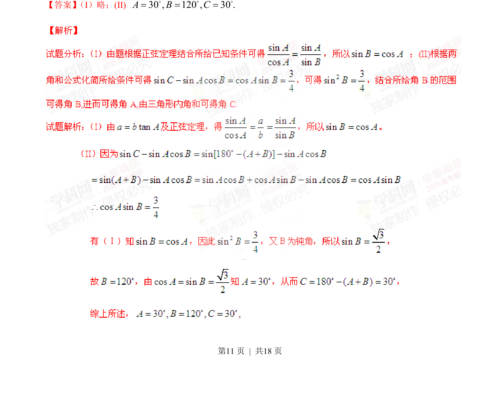
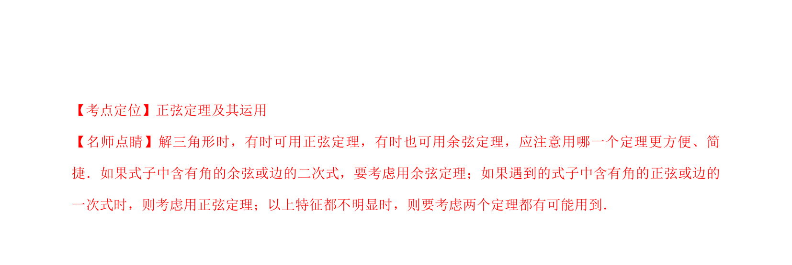

## 题面

## 摘要

三角形中边角关系的证明与求解，涉及正弦定理和三角恒等变换。

## 关联考点

- [[126-定理|正弦定理]]
- [[272-三角恒等变换|三角恒等变换]]
- [[589-解三角形|解三角形]]

## 答案与解析

> 📄 原 PDF 第 11 页：`素材/真题/湖南/2008-2024·（湖南）数学高考真题/2015年高考数学试卷（文）（湖南）（解析卷）.pdf`
