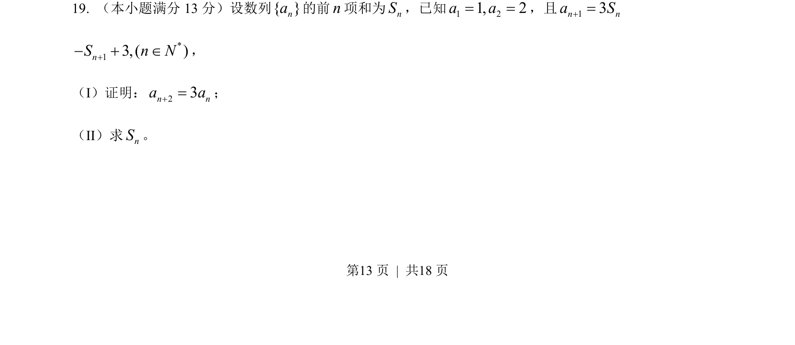
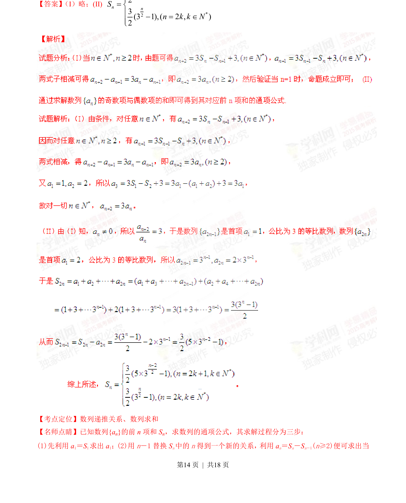
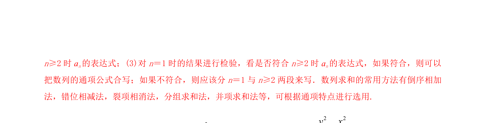

## 题面

## 摘要

该题考查数列递推关系的证明及前n项和的求解，涉及构造等比数列求通项与求和。

## 关联考点

- [[1382-数列递推|数列递推]]
- [[1067-等比数列的定义与通项公式|等比数列]]
- [[385-数列错位相减|错位相减法]]
- [[1081-累加求和|数列求和]]

## 答案与解析

> 📄 原 PDF 第 13 页：`素材/真题/湖南/2008-2024·（湖南）数学高考真题/2015年高考数学试卷（文）（湖南）（解析卷）.pdf`
