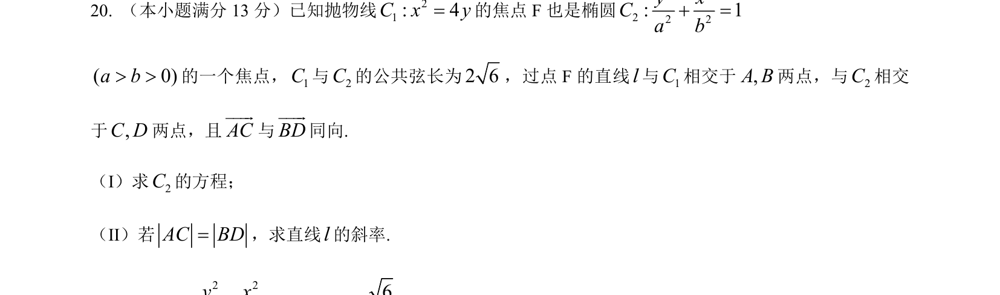
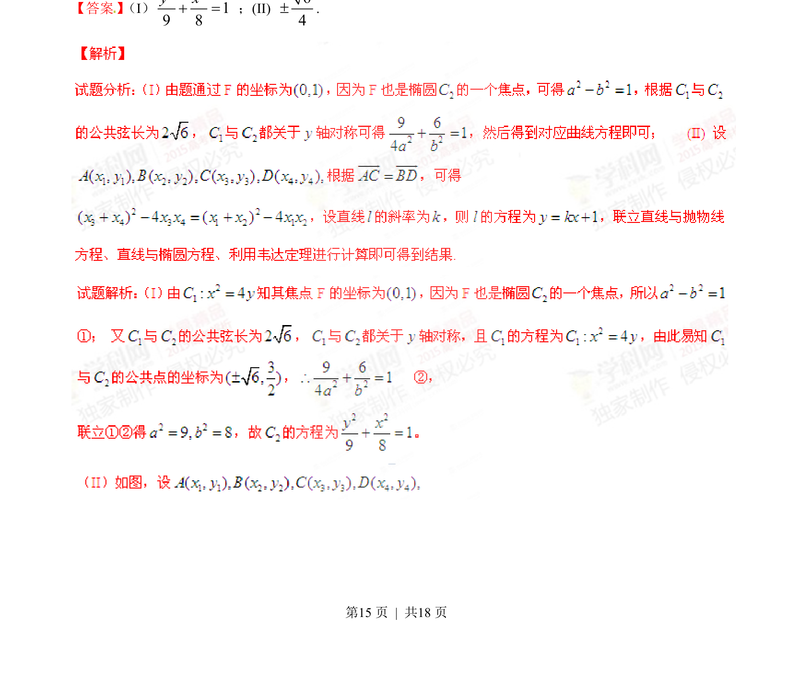
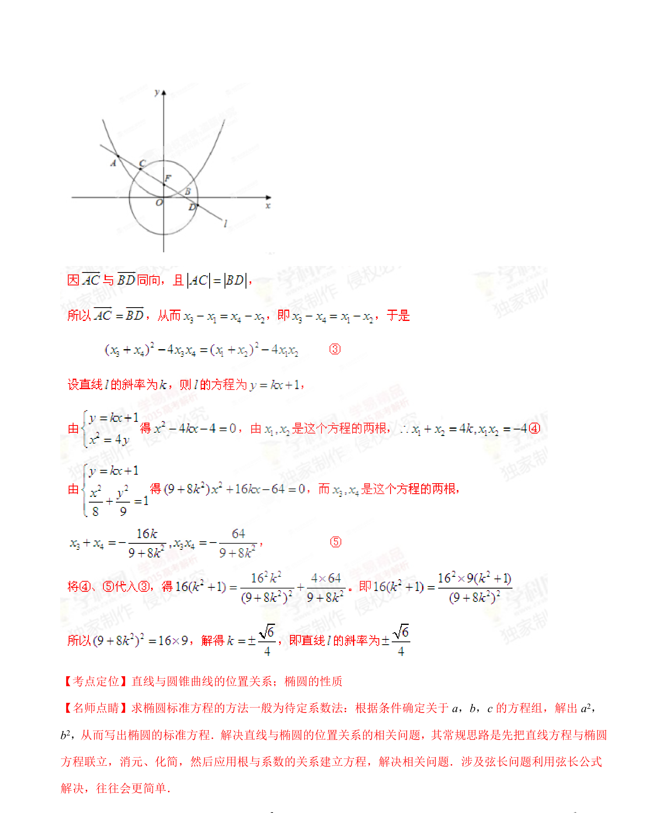

## 题面

## 摘要

求抛物线、椭圆共焦点、公共弦下椭圆方程，并利用线段相等条件求直线斜率。

## 关联考点

- [[941-椭圆标准方程|椭圆标准方程]]
- [[378-抛物线几何性质|抛物线性质]]
- [[1005-直线与圆锥曲线位置关系|直线与圆锥曲线位置关系]]
- [[869-弦长计算|弦长计算]]

## 答案与解析

> 📄 原 PDF 第 15 页：`素材/真题/湖南/2008-2024·（湖南）数学高考真题/2015年高考数学试卷（文）（湖南）（解析卷）.pdf`
