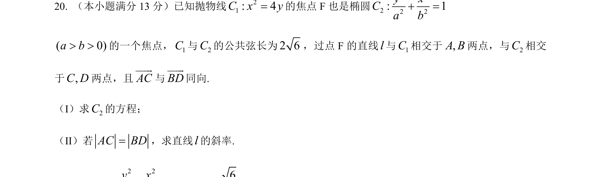
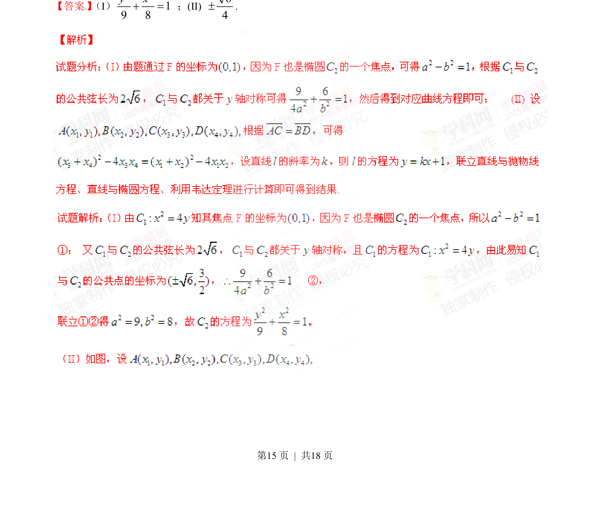
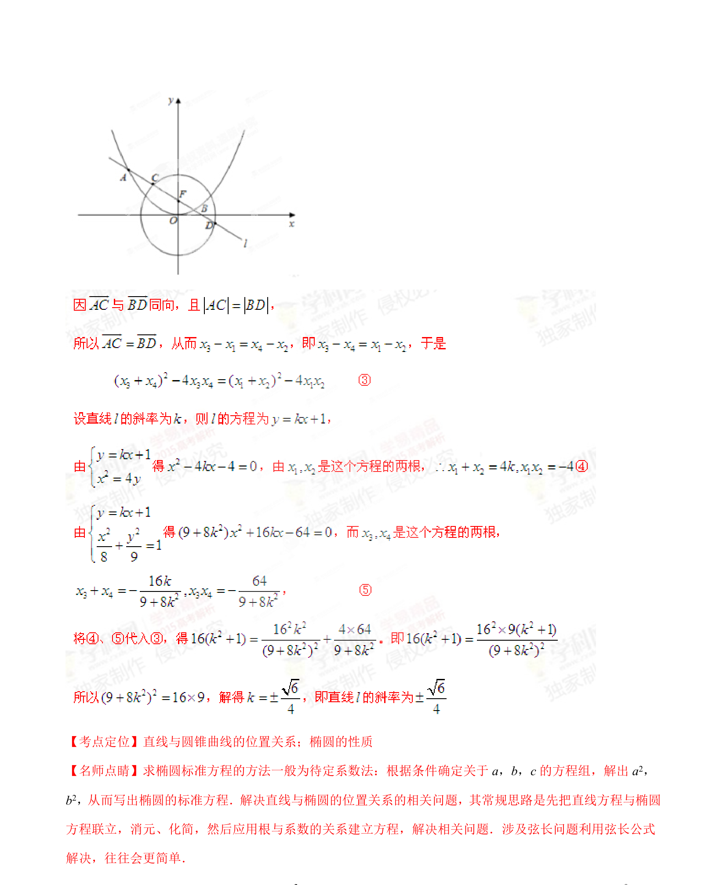

## 题面

## 摘要

求抛物线、椭圆共焦点、公共弦下椭圆方程，并利用线段相等条件求直线斜率。

## 关联考点

- [[941-椭圆标准方程|椭圆标准方程]]
- [[378-抛物线几何性质|抛物线性质]]
- [[1006-直线与圆锥曲线的位置关系|直线与圆锥曲线位置关系]]
- [[869-弦长计算|弦长计算]]

## 答案与解析

> 📄 原 PDF 第 15 页：`素材/真题/湖南/2008-2024·（湖南）数学高考真题/2015年高考数学试卷（文）（湖南）（解析卷）.pdf`

<!-- 题干文本-start -->
## 题干文本
20. （本小题满分13分）已知抛物线 的焦点F也是椭圆
的一个焦点， 与 的公共弦长为 ，过点F的直线 与 相交于 两点，与 相交
于 两点，且 与 同向.
（I）求 的方程；
（II）若 ，求直线 的斜率.
<!-- 题干文本-end -->

<!-- 解析文本-start -->
## 解析文本
【答案】 （I） ；(II) .
21: 4C x y=2 222 2: 1y xCa b+ =( 0)a b> >1C2C2 6l1C,A B2C,C DACuuu rBDuuu r2CAC BD=l
2 219 8y x+ =64±
<!-- 解析文本-end -->
