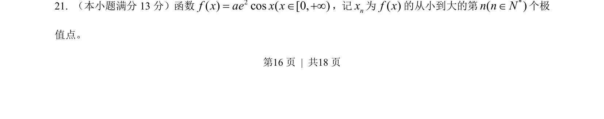
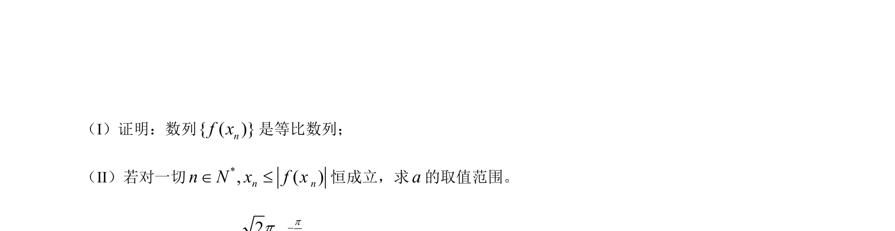
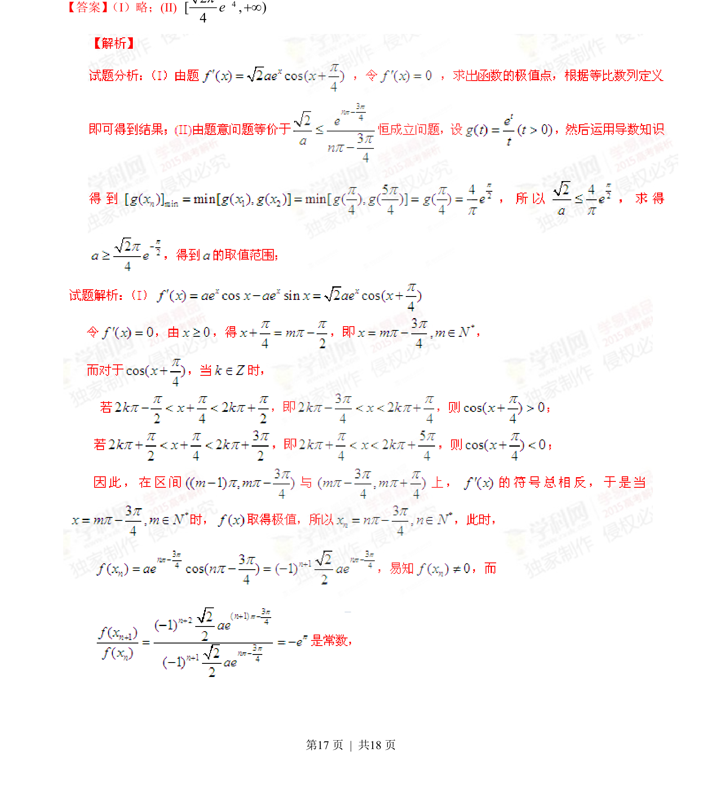
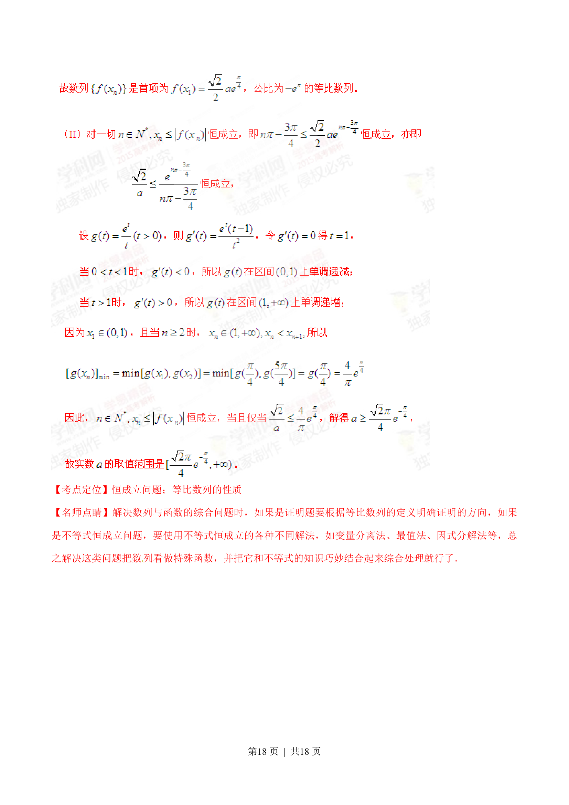

## 题面

## 摘要

考查含参指数与三角函数乘积的极值点序列问题，涉及求导、解三角方程与数列归纳。

## 关联考点

- [[548-导数与极值|导数与极值]]
- [[三角函数方程]]
- [[数列通项]]

## 答案与解析

> 📄 原 PDF 第 16 页：`素材/真题/湖南/2008-2024·（湖南）数学高考真题/2015年高考数学试卷（文）（湖南）（解析卷）.pdf`
