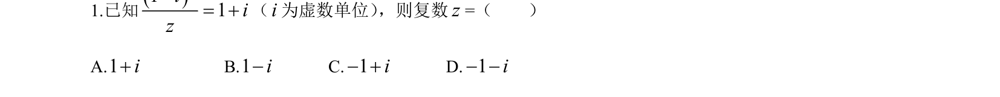
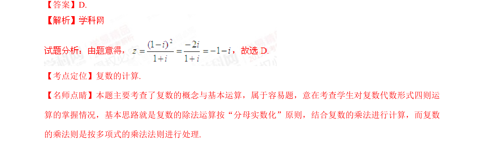

## 题面

## 摘要

本题主要考查复数的除法运算和基本概念，通过分母实数化进行化简求解。

## 关联考点

- [[805-复数的四则运算|复数的四则运算]]
- [[复数的概念]]

## 答案与解析

> 📄 原 PDF 第 1 页：`素材/真题/湖南/2008-2024·（湖南）数学高考真题/2015年高考数学试卷（理）（湖南）（解析卷）.pdf`

<!-- 题干文本-start -->
## 题干文本
1.已知 （ 为虚数单位） ，则复数=（    ）
A.          B.       C.       D.
<!-- 题干文本-end -->

<!-- 解析文本-start -->
## 解析文本
【答案】D.
【考点定位】复数的计算.
【名师点睛】本题主要考查了复数的概念与基本运算，属于容易题，意在考查学生对复数代数形式四则运
算的掌握情况，基本思路就是复数的除法运算按“分母实数化”原则，结合复数的乘法进行计算，而复数
的乘法则是按多项式的乘法法则进行处理.
<!-- 解析文本-end -->
