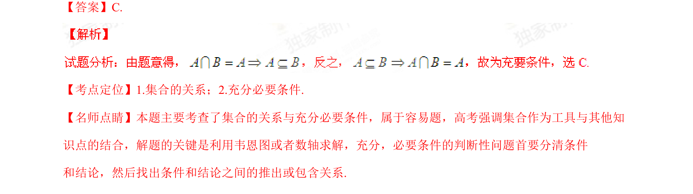

## 题面

## 摘要

本题主要考查集合关系与充分必要条件的判断，通过集合的包含关系推出充要条件。

## 关联考点

- [[集合的关系]]
- [[533-充分必要条件|充分必要条件]]

## 答案与解析

> 📄 原 PDF 第 1 页：`素材/真题/湖南/2008-2024·（湖南）数学高考真题/2015年高考数学试卷（理）（湖南）（解析卷）.pdf`

<!-- 题干文本-start -->
## 题干文本
2.设 ， 是两个集合，则“ ”是“ ”的（    ）
A.充分不必要条件      B.必要不充分条件      C.充要条件      D.既不充分也不必要条件
<!-- 题干文本-end -->

<!-- 解析文本-start -->
## 解析文本
【答案】C.
【考点定位】1.集合的关系；2.充分必要条件.
【名师点睛】本题主要考查了集合的关系与充分必要条件，属于容易题，高考强调集合作为工具与其他知
识点的结合，解题的关键是利用韦恩图或者数轴求解，充分，必要条件的判断性问题首要分清条件
和结论，然后找出条件和结论之间的推出或包含关系.
<!-- 解析文本-end -->
