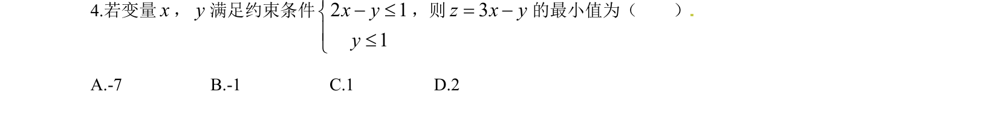
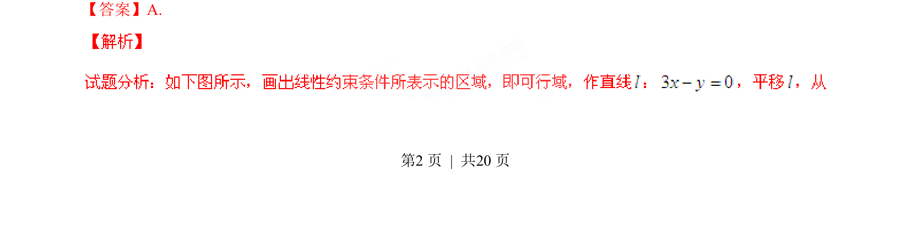
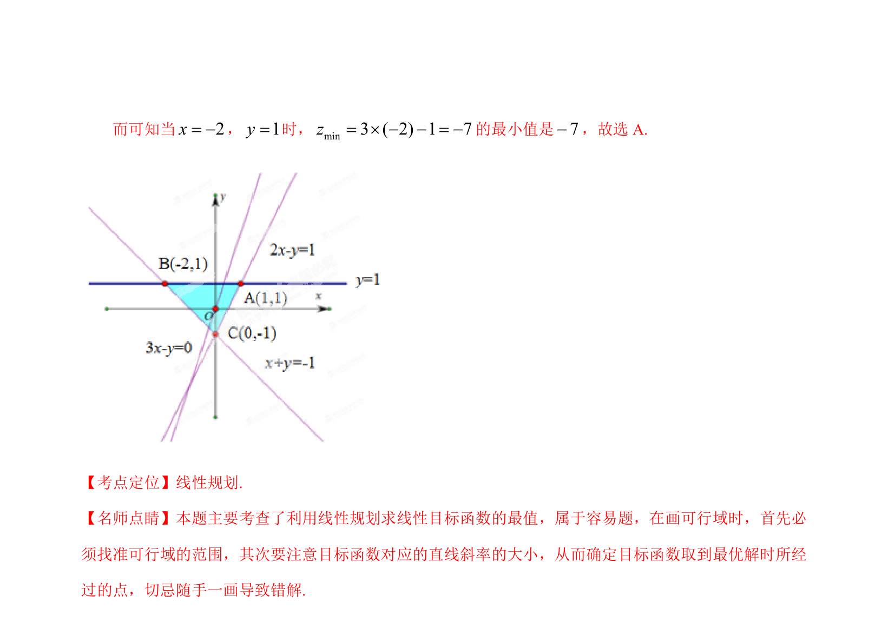

## 题面

## 摘要

线性规划求目标函数最小值，通过约束条件画可行域并平移目标函数直线求解。

## 关联考点

- [[1074-简单线性规划|线性规划]]
- [[1156-可行域|可行域]]
- [[999-目标函数|目标函数]]
- [[286-函数的最值|最小值]]

## 答案与解析

> 📄 原 PDF 第 2 页：`素材/真题/湖南/2008-2024·（湖南）数学高考真题/2015年高考数学试卷（理）（湖南）（解析卷）.pdf`
