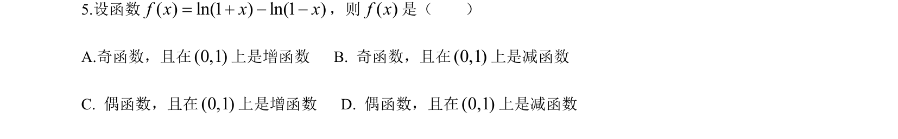
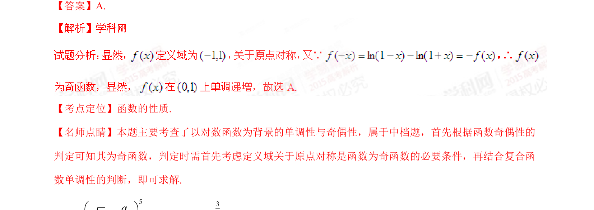

## 题面

## 摘要

本题主要考查对数函数的奇偶性判定与复合函数在指定区间内的单调性分析。

## 关联考点

- [[298-对数函数|对数函数]]
- [[817-奇偶性|奇偶性]]
- [[719-单调性|单调性]]
- [[296-复合函数|复合函数]]

## 答案与解析

> 📄 原 PDF 第 3 页：`素材/真题/湖南/2008-2024·（湖南）数学高考真题/2015年高考数学试卷（理）（湖南）（解析卷）.pdf`

<!-- 题干文本-start -->
## 题干文本
5.设函数 ，则 是（    ）
A.奇函数，且在 上是增函数   B. 奇函数，且在 上是减函数
C. 偶函数，且在 上是增函数   D. 偶函数，且在 上是减函数
<!-- 题干文本-end -->

<!-- 解析文本-start -->
## 解析文本
【答案】A.
【考点定位】函数的性质.
【名师点睛】本题主要考查了以对数函数为背景的单调性与奇偶性，属于中档题，首先根据函数奇偶性的
判定可知其为奇函数，判定时需首先考虑定义域关于原点对称是函数为奇函数的必要条件，再结合复合函
数单调性的判断，即可求解.
<!-- 解析文本-end -->
