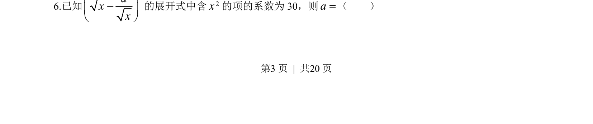
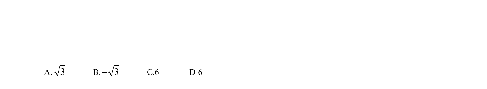
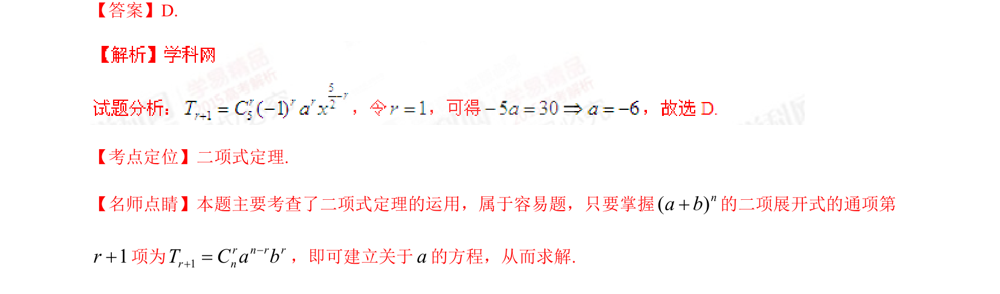

## 题面

## 摘要

已知二项展开式中含 x 项的系数，求参数 a。

## 关联考点

- [[472-二项式定理|二项式定理]]
- [[1160-展开式通项|展开式通项]]
- [[1079-系数求解|系数求解]]

## 答案与解析

> 📄 原 PDF 第 3 页：`素材/真题/湖南/2008-2024·（湖南）数学高考真题/2015年高考数学试卷（理）（湖南）（解析卷）.pdf`
