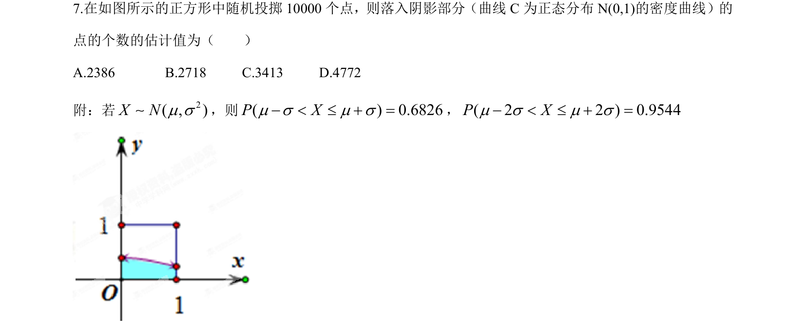
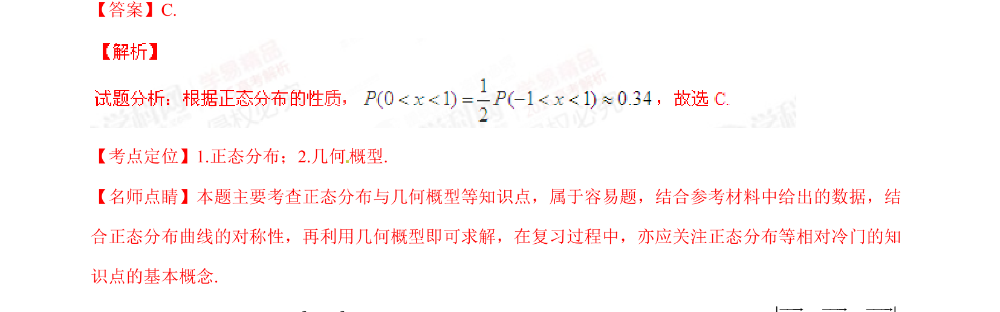

## 题面

## 摘要

本题结合正态分布密度曲线与几何概型，通过随机模拟估计阴影部分面积对应的概率，考查正态分布对称性及区间概率计算。

## 关联考点

- [[496-正态分布概念|正态分布]]
- [[667-几何概型|几何概型]]

## 答案与解析

> 📄 原 PDF 第 4 页：`素材/真题/湖南/2008-2024·（湖南）数学高考真题/2015年高考数学试卷（理）（湖南）（解析卷）.pdf`
