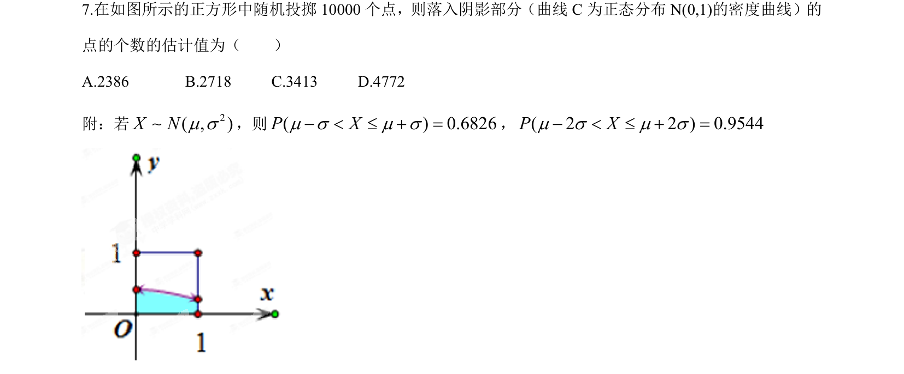
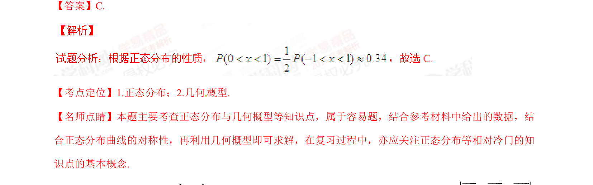

## 题面

## 摘要

本题结合正态分布密度曲线与几何概型，通过随机模拟估计阴影部分面积对应的概率，考查正态分布对称性及区间概率计算。

## 关联考点

- [[496-正态分布概念|正态分布]]
- [[667-几何概型|几何概型]]

## 答案与解析

> 📄 原 PDF 第 4 页：`素材/真题/湖南/2008-2024·（湖南）数学高考真题/2015年高考数学试卷（理）（湖南）（解析卷）.pdf`

<!-- 题干文本-start -->
## 题干文本
7.在如图所示的正方形中随机投掷10000个点，则落入阴影部分（曲线C为正态分布N(0,1)的密度曲线）的
点的个数的估计值为（    ）
A.2386       B.2718     C.3413     D.4772
附：若 ，则 ，
<!-- 题干文本-end -->

<!-- 解析文本-start -->
## 解析文本
【答案】C.
【考点定位】1.正态分布；2.几何概型.
【名师点睛】本题主要考查正态分布与几何概型等知识点，属于容易题，结合参考材料中给出的数据，结
合正态分布曲线的对称性，再利用几何概型即可求解，在复习过程中，亦应关注正态分布等相对冷门的知
识点的基本概念.
<!-- 解析文本-end -->
