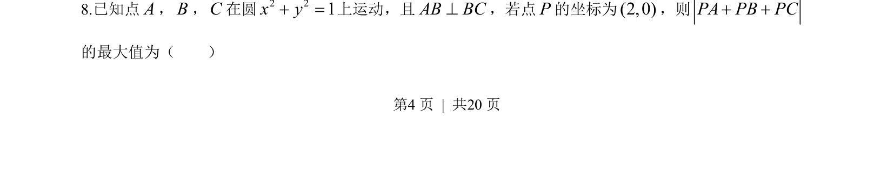
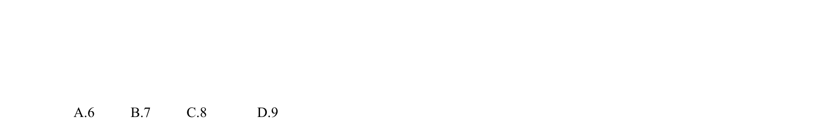
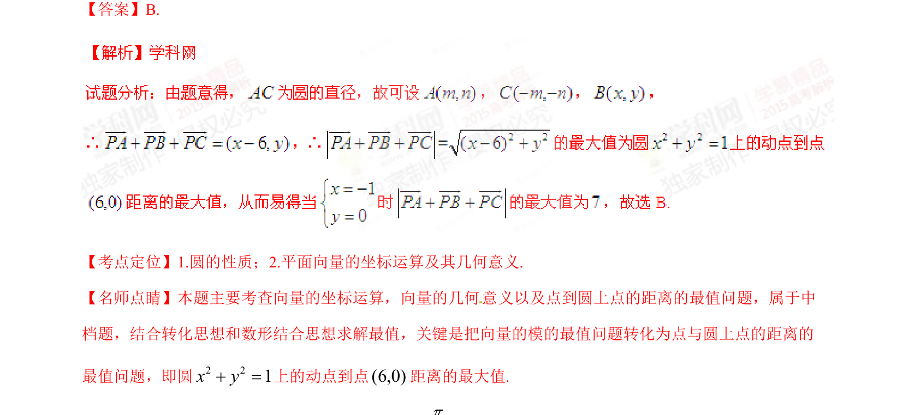

## 题面

## 摘要

已知点在单位圆上且满足垂直关系，求定点与动点组成的向量和的模最大值，考查圆的性质与向量运算的几何最值问题。

## 关联考点

- [[781-圆的性质|圆的性质]]
- [[752-向量模长|向量模长]]
- [[665-几何最值|几何最值]]

## 答案与解析

> 📄 原 PDF 第 4 页：`素材/真题/湖南/2008-2024·（湖南）数学高考真题/2015年高考数学试卷（理）（湖南）（解析卷）.pdf`
