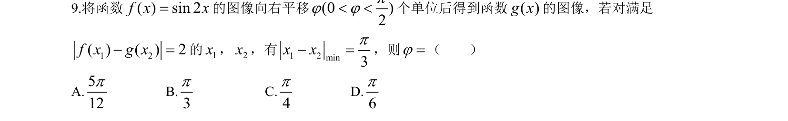
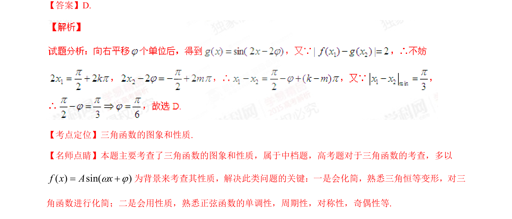

## 题面

## 摘要

考查三角函数图像的平移变换及利用函数值差的绝对值与自变量差的最值求参数。

## 关联考点

- [[三角函数的图象]]
- [[三角函数的性质]]
- [[图像平移]]

## 答案与解析

> 📄 原 PDF 第 5 页：`素材/真题/湖南/2008-2024·（湖南）数学高考真题/2015年高考数学试卷（理）（湖南）（解析卷）.pdf`

<!-- 题干文本-start -->
## 题干文本
9.将函数 的图像向右平移 个单位后得到函数 的图像，若对满足
的 ， ，有 ，则 （    ）
A.         B.           C.         D.
<!-- 题干文本-end -->

<!-- 解析文本-start -->
## 解析文本
【答案】D.
【考点定位】三角函数的图象和性质.
【名师点睛】本题主要考查了三角函数的图象和性质，属于中档题，高考题对于三角函数的考查，多以
为背景来考查其性质，解决此类问题的关键：一是会化简，熟悉三角恒等变形，对三
角函数进行化简；二是会用性质，熟悉正弦函数的单调性，周期性，对称性，奇偶性等.
<!-- 解析文本-end -->
