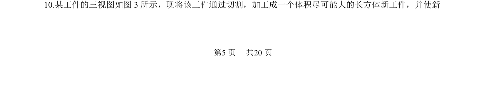
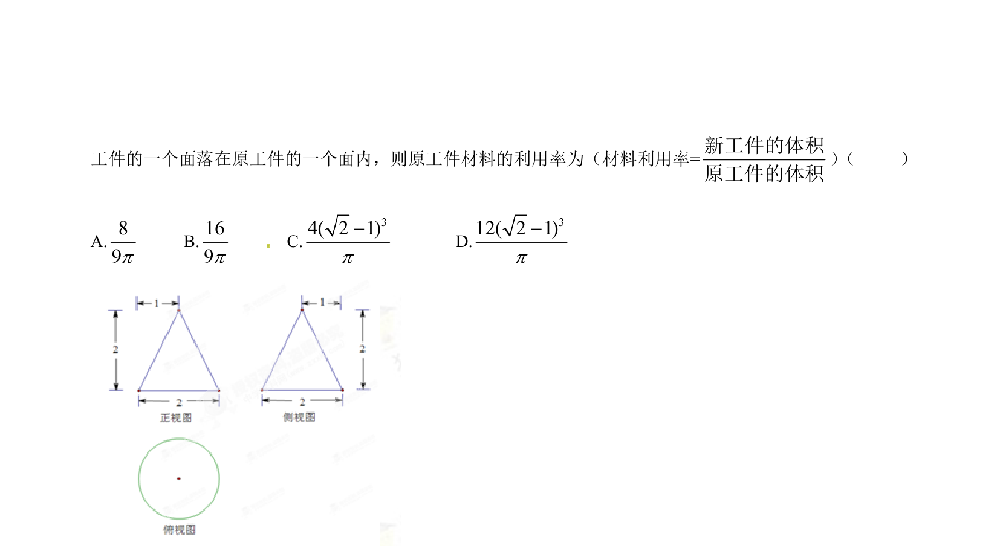
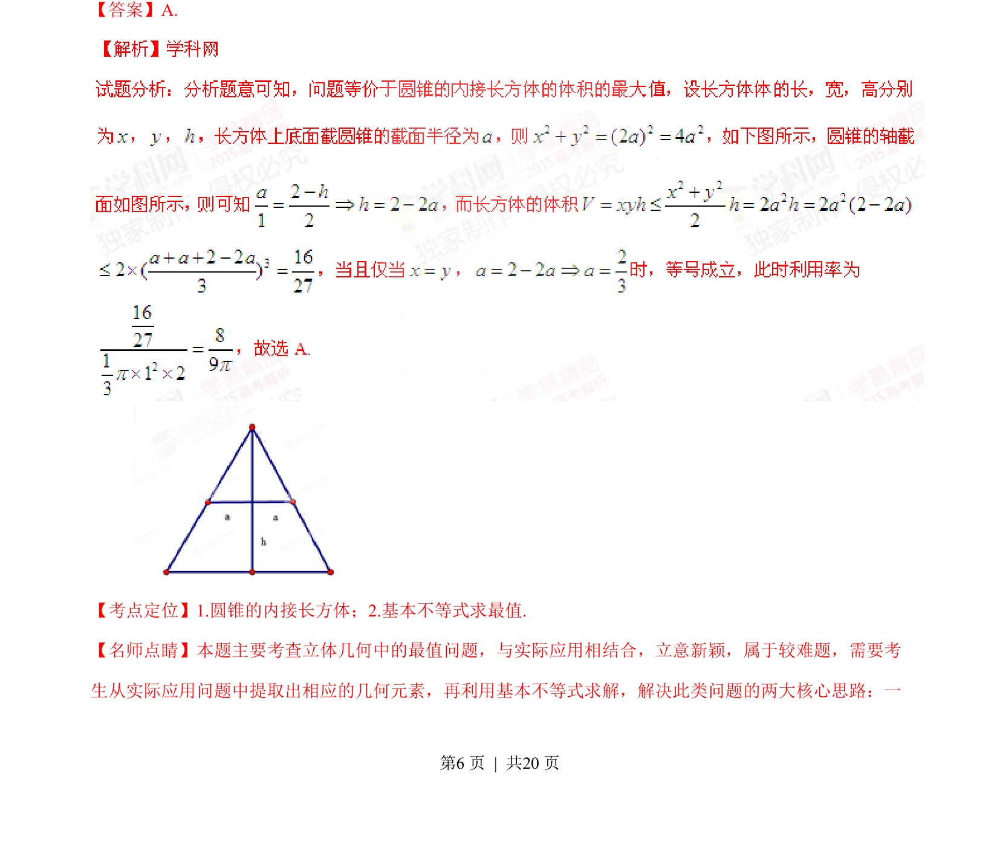
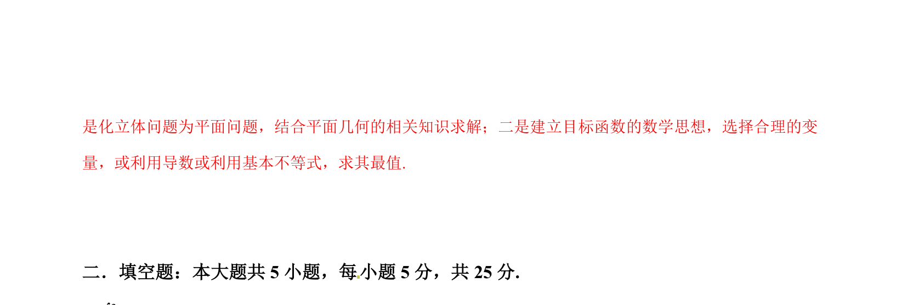

## 题面

## 摘要

根据三视图还原几何体并切割加工最大体积长方体，考查空间想象与最值计算。

## 关联考点

- [[1056-立体图形还原|三视图还原几何体]]
- [[长方体体积最值]]
- [[1049-空间几何计算|空间几何计算]]

## 答案与解析

> 📄 原 PDF 第 5 页：`素材/真题/湖南/2008-2024·（湖南）数学高考真题/2015年高考数学试卷（理）（湖南）（解析卷）.pdf`
