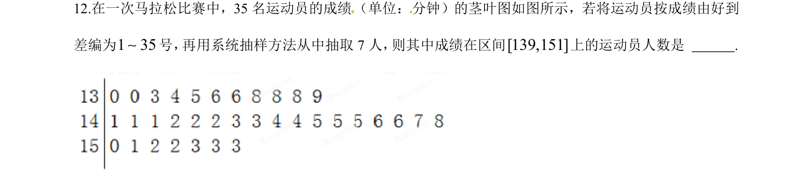
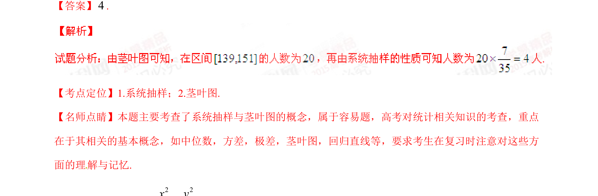

## 题面

## 摘要

本题主要考查系统抽样方法结合茎叶图的数据抽取，属于基础概念应用题。

## 关联考点

- [[1420-系统抽样|系统抽样]]
- [[360-茎叶图|茎叶图]]

## 答案与解析

> 📄 原 PDF 第 7 页：`素材/真题/湖南/2008-2024·（湖南）数学高考真题/2015年高考数学试卷（理）（湖南）（解析卷）.pdf`

<!-- 题干文本-start -->
## 题干文本
12.在一次马拉松比赛中，35名运动员的成绩（单位：分钟）的茎叶图如图所示，若将运动员按成绩由好到
差编为 号， 再用系统抽样方法从中抽取7人， 则其中成绩在区间 上的运动员人数是       .
<!-- 题干文本-end -->

<!-- 解析文本-start -->
## 解析文本
【答案】.
【考点定位】1.系统抽样；2.茎叶图.
【名师点睛】本题主要考查了系统抽样与茎叶图的概念，属于容易题，高考对统计相关知识的考查，重点
在于其相关的基本概念，如中位数，方差，极差，茎叶图，回归直线等，要求考生在复习时注意对这些方
面的理 解与记忆.
<!-- 解析文本-end -->
