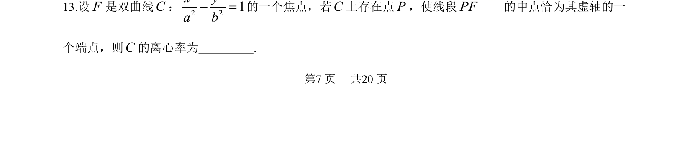
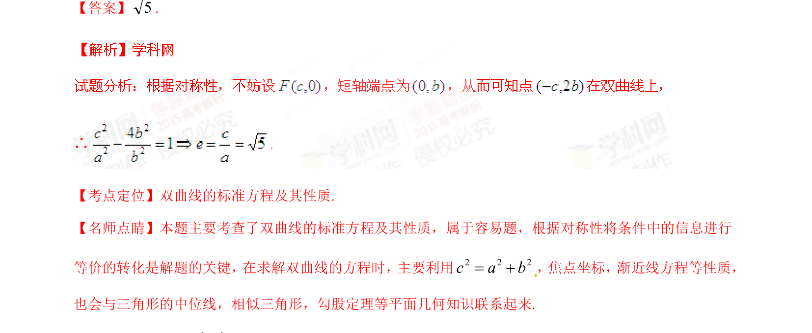

## 题面

## 摘要

求椭圆方程及与抛物线公共弦、直线与两曲线相交线段相等的斜率问题

## 关联考点

- [[061-方程|椭圆的标准方程]]
- [[抛物线的简单几何性质]]
- [[1006-直线与圆锥曲线的位置关系|直线与圆锥曲线的位置关系]]
- [[弦长与向量共线]]

## 答案与解析

> 📄 原 PDF 第 7 页：`素材/真题/湖南/2008-2024·（湖南）数学高考真题/2015年高考数学试卷（理）（湖南）（解析卷）.pdf`
