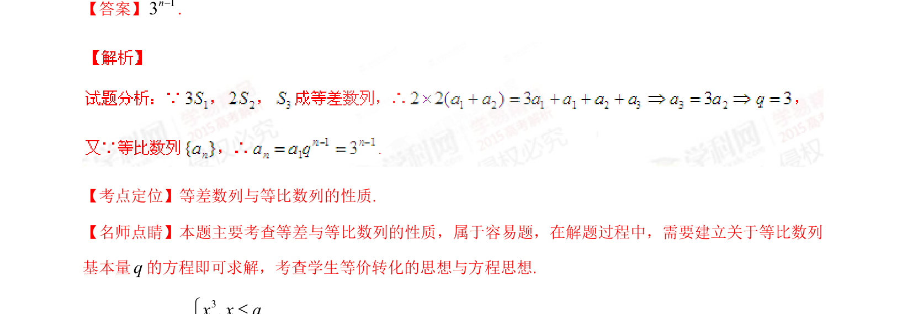

## 题面

## 摘要

本题通过等差与等比数列性质建立方程，求等比数列通项。

## 关联考点

- [[1067-等比数列的定义与通项公式|等比数列]]
- [[356-等差数列概念|等差数列]]
- [[355-等差数列前n项和|前n项和]]
- [[906-方程思想|方程思想]]

## 答案与解析

> 📄 原 PDF 第 8 页：`素材/真题/湖南/2008-2024·（湖南）数学高考真题/2015年高考数学试卷（理）（湖南）（解析卷）.pdf`
