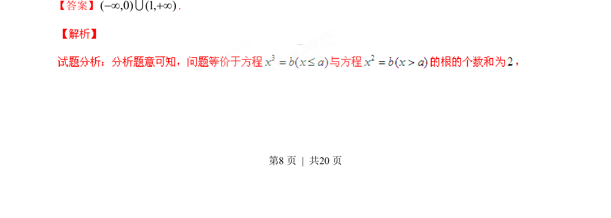
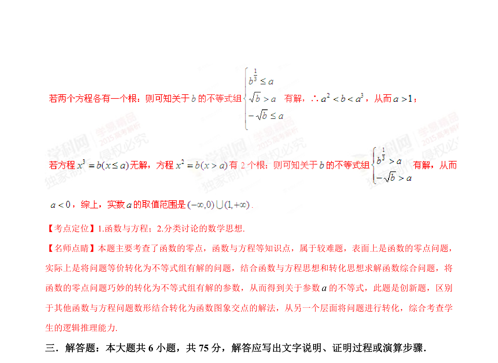

## 题面

## 摘要

已知分段函数，通过存在实数b使g(x)=f(x)-b有两个零点，求参数a的取值范围。

## 关联考点

- [[288-函数零点|函数零点]]
- [[290-分段函数|分段函数]]
- [[726-参数范围|参数范围]]
- [[897-数形结合|数形结合]]

## 答案与解析

> 📄 原 PDF 第 8 页：`素材/真题/湖南/2008-2024·（湖南）数学高考真题/2015年高考数学试卷（理）（湖南）（解析卷）.pdf`

<!-- 题干文本-start -->
## 题干文本
15.已知 ，若存在实数 ，使函数 有两个零点，则 的取值范围
    是           .
<!-- 题干文本-end -->

<!-- 解析文本-start -->
## 解析文本
【答案】.
5
222bac+=
nSnan11a=13S22S3Sna=13-n
q32,( ),x x af xx x aì£=í>îb( ) ( )g x f x b= -a),1()0,(+-
<!-- 解析文本-end -->
