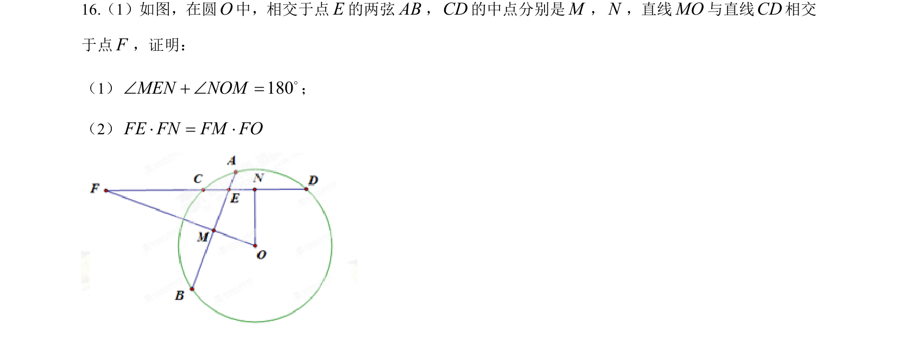
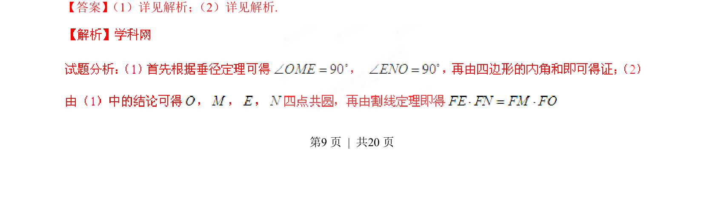
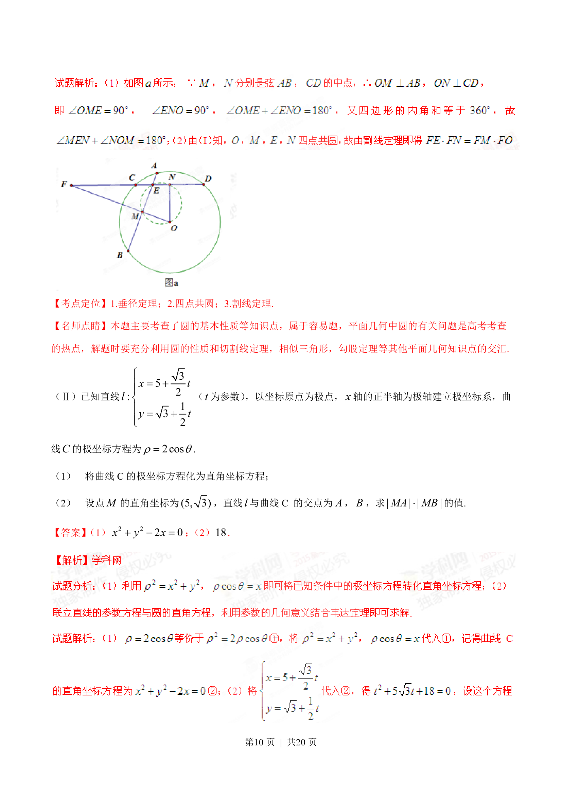
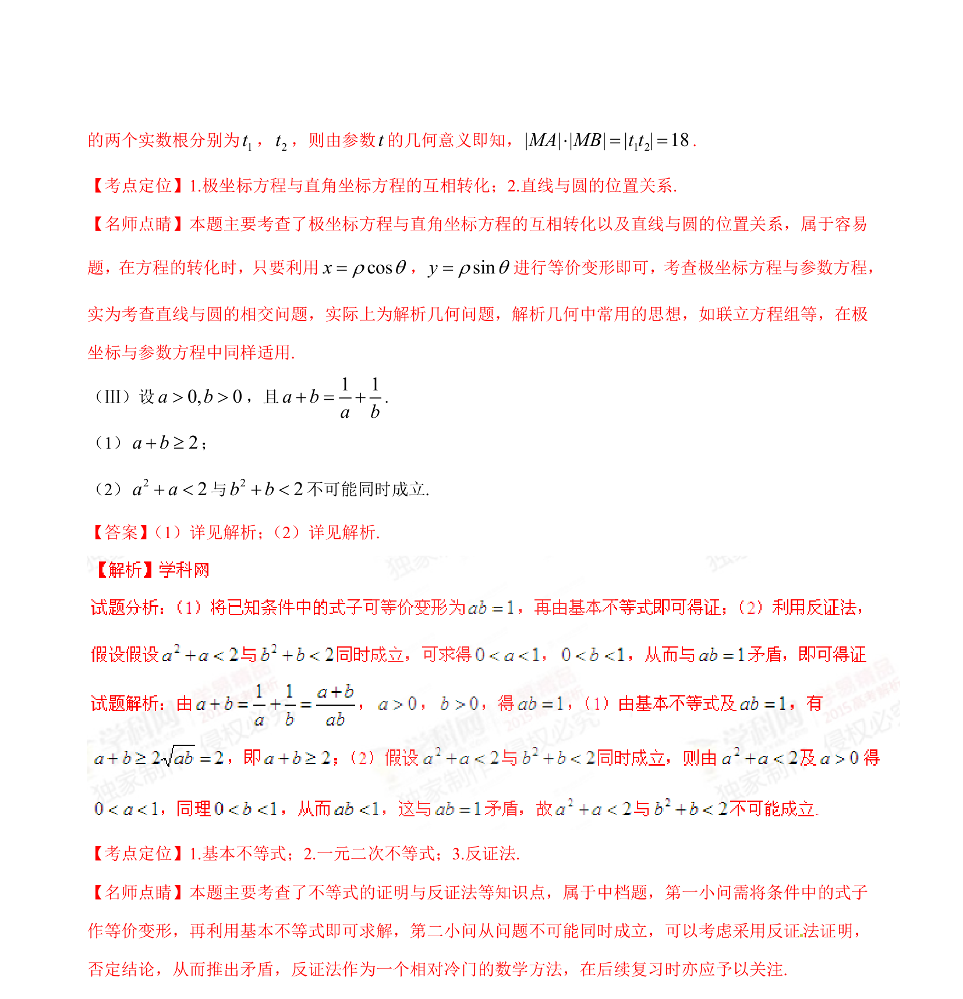

## 题面

## 摘要

平面几何圆内接四边形与相交弦的性质证明，运用弦中点及等角定理推导角度与线段乘积关系

## 关联考点

- [[781-圆的性质|圆的性质]]
- [[弦中点性质]]
- [[1416-相交弦定理|相交弦定理]]
- [[1033-相似三角形|相似三角形]]

## 答案与解析

> 📄 原 PDF 第 9 页：`素材/真题/湖南/2008-2024·（湖南）数学高考真题/2015年高考数学试卷（理）（湖南）（解析卷）.pdf`
