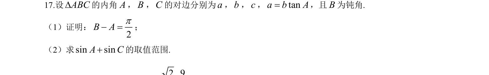
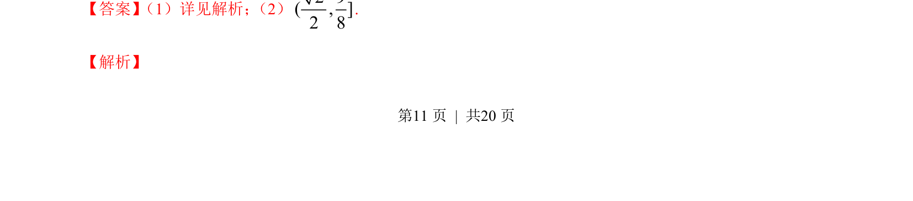
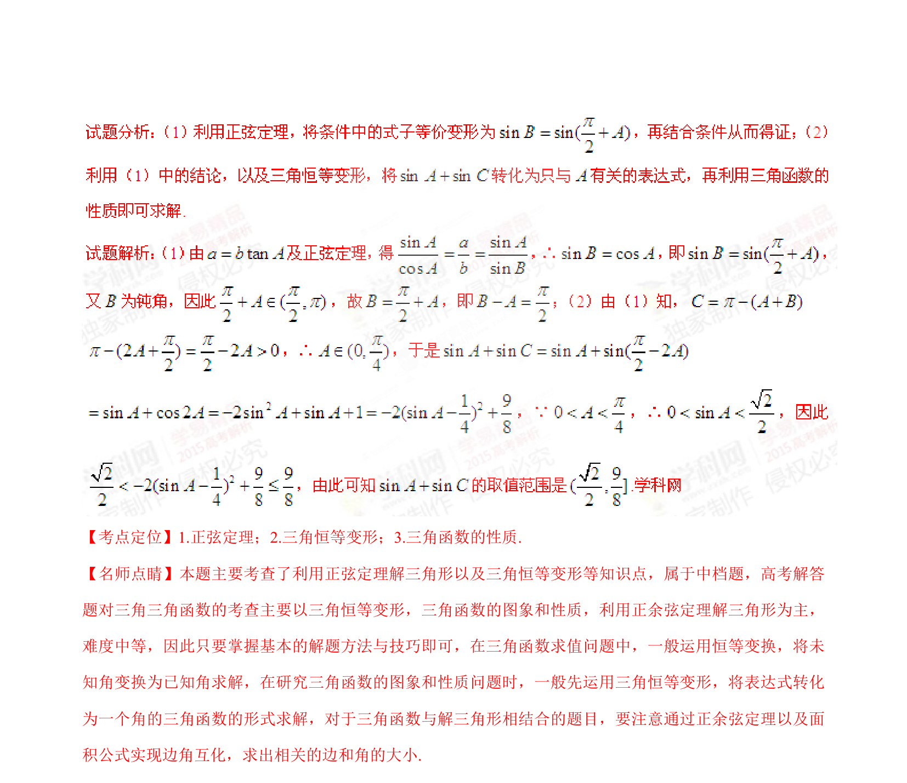

## 题面

## 摘要

该题考查三角形中边角关系，通过正切条件证明角的关系并求正弦和的取值范围。

## 关联考点

- [[589-解三角形|解三角形]]
- [[126-定理|正弦定理]]
- [[272-三角恒等变换|三角恒等变换]]
- [[676-函数值域|函数值域]]

## 答案与解析

> 📄 原 PDF 第 11 页：`素材/真题/湖南/2008-2024·（湖南）数学高考真题/2015年高考数学试卷（理）（湖南）（解析卷）.pdf`
