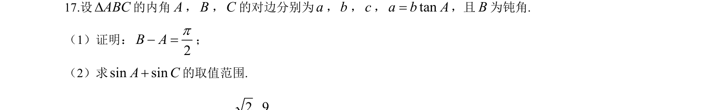
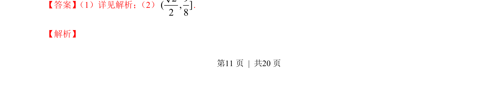
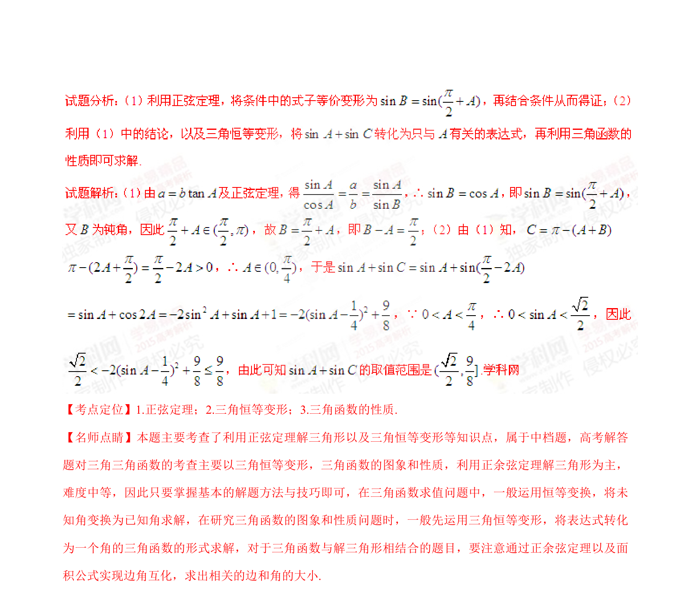

## 题面

## 摘要

该题考查三角形中边角关系，通过正切条件证明角的关系并求正弦和的取值范围。

## 关联考点

- [[589-解三角形|解三角形]]
- [[126-定理|正弦定理]]
- [[272-三角恒等变换|三角恒等变换]]
- [[676-函数值域|函数值域]]

## 答案与解析

> 📄 原 PDF 第 11 页：`素材/真题/湖南/2008-2024·（湖南）数学高考真题/2015年高考数学试卷（理）（湖南）（解析卷）.pdf`

<!-- 题干文本-start -->
## 题干文本
17.设 的内角 ， ， 的对边分别为 ， ， ， ，且 为钝角.
（1）证明： ；
（2）求 的取值范围.
<!-- 题干文本-end -->

<!-- 解析文本-start -->
## 解析文本
【答案】 （1）详见解析； （2）.
【解析】
1t2tt 1821==|t|t|MB||MA|qrcos=xqrsin=y0,0ab>>1 1a ba b+ = +2a b+ ³22a a+ <22b b+ <
ABCDABCabctana b A=B2B Ap- =sin sinA C+29(,]28
<!-- 解析文本-end -->
