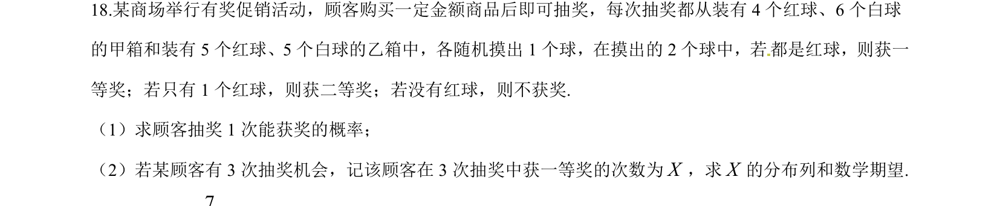
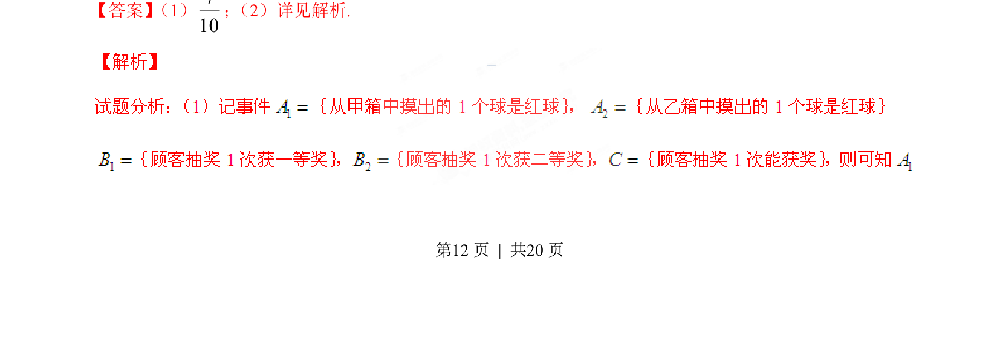
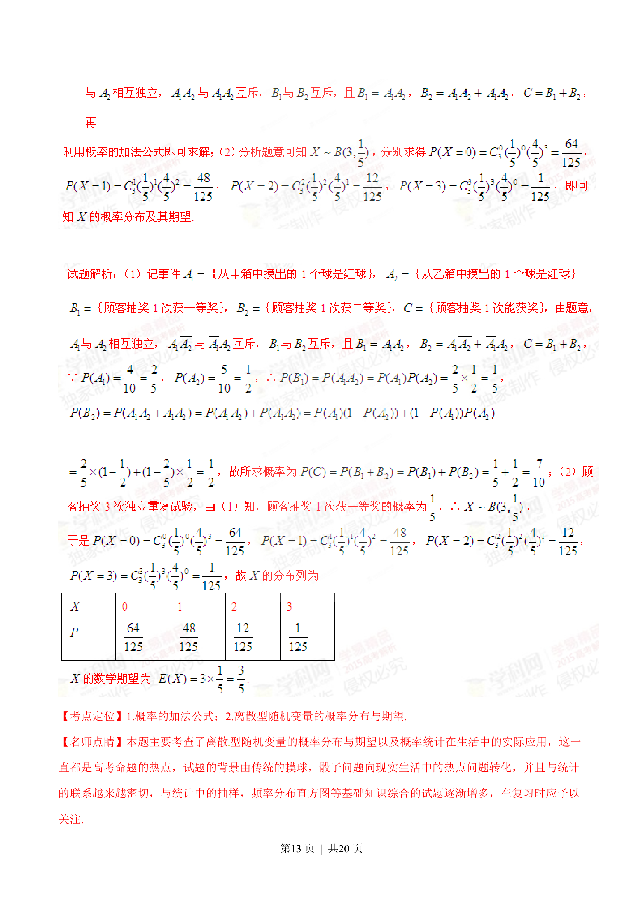
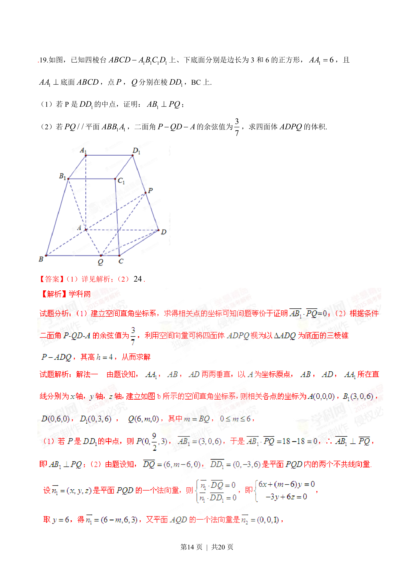
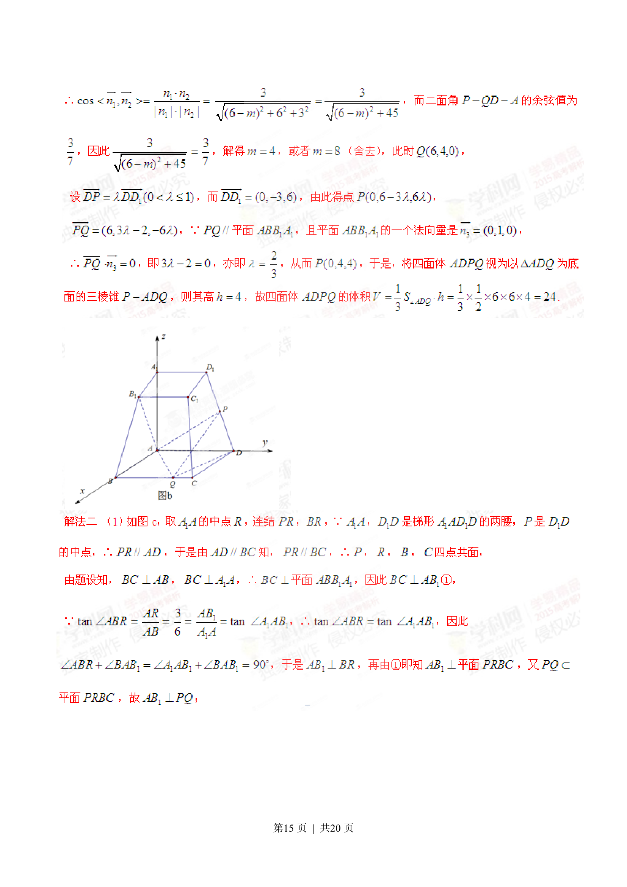
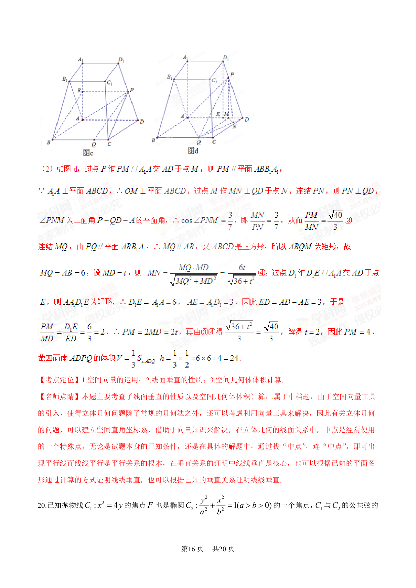
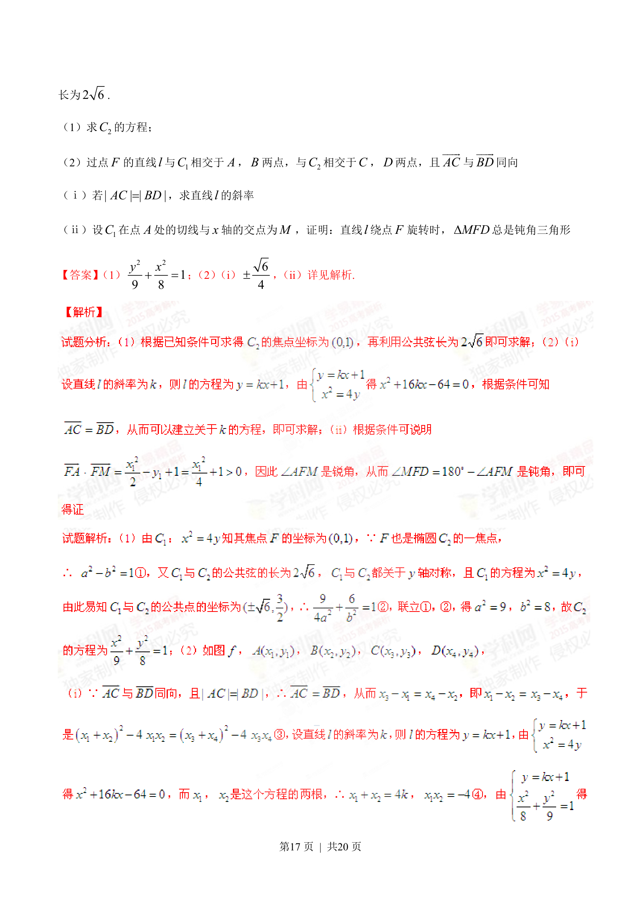
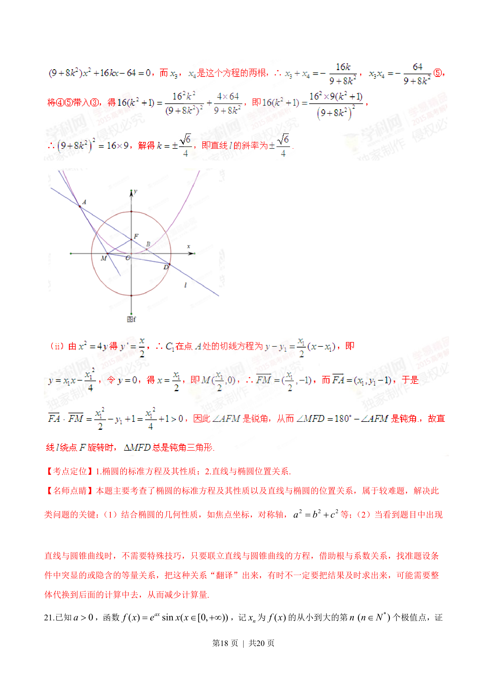
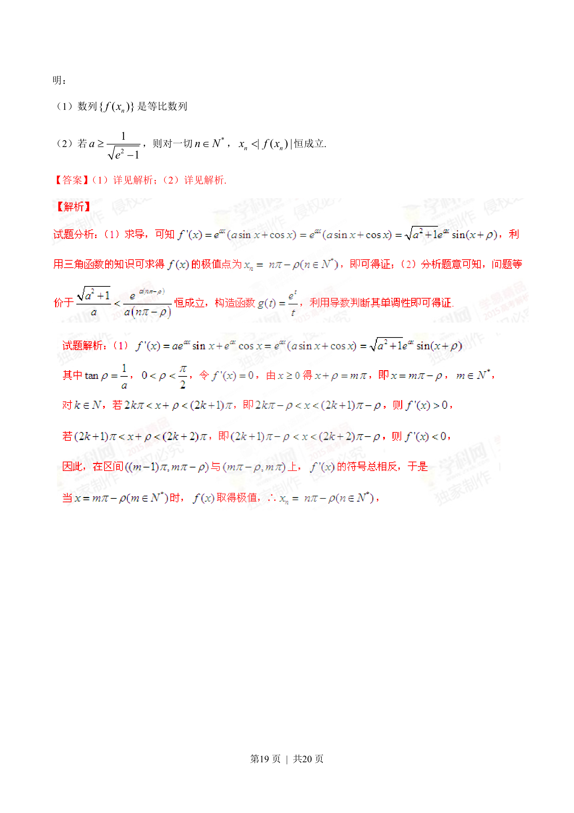
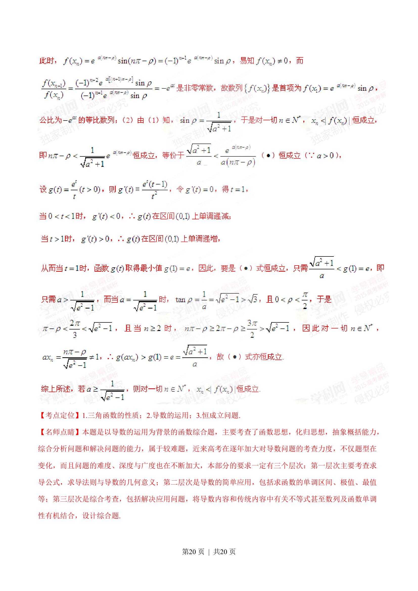

## 题面

## 摘要

顾客抽奖一次获奖概率计算，以及多次抽奖中一等奖次数的分布列与期望。

## 关联考点

- [[320-古典概型|古典概型]]
- [[317-事件的关系运算|互斥事件]]
- [[469-二项分布|二项分布]]
- [[1039-离散型随机变量的期望|数学期望]]

## 答案与解析

> 📄 原 PDF 第 12 页：`素材/真题/湖南/2008-2024·（湖南）数学高考真题/2015年高考数学试卷（理）（湖南）（解析卷）.pdf`
