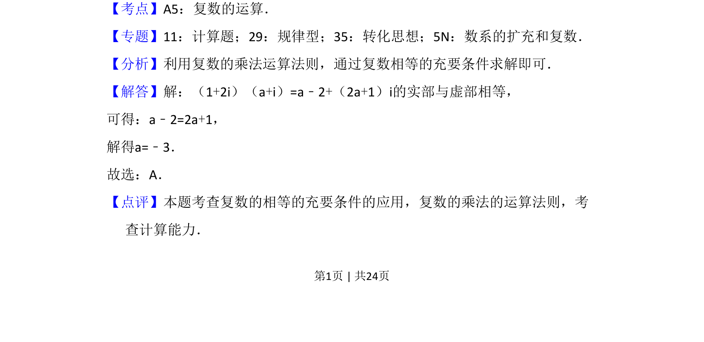

## 题面

## 摘要

该题考查复数的乘法运算及实部虚部相等条件的应用。

## 关联考点

- [[复数的乘法]]
- [[809-复数相等|复数相等]]
- [[实部与虚部]]

## 答案与解析

> 📄 原 PDF 第 1 页：`素材/真题/湖南/2008-2024·（湖南）数学高考真题/2016年高考数学试卷（文）（新课标Ⅰ）（解析卷）.pdf`

<!-- 题干文本-start -->
## 题干文本
2．（5分）设（1+2i）（a+i）的实部与虚部相等，其中a为实数，则a等于（　　
）
A．﹣3 B．﹣2 C．2 D．3
<!-- 题干文本-end -->

<!-- 解析文本-start -->
## 解析文本
【考点】A5：复数的运算．菁优网版权所有
【专题】11：计算题；29：规律型；35：转化思想；5N：数系的扩充和复数．
【分析】利用复数的乘法运算法则，通过复数相等的充要条件求解即可．
【解答】解：（1+2i）（a+i）=a﹣2+（2a+1）i的实部与虚部相等，
可得：a﹣2=2a+1，
解得a=﹣3．
故选：A．
【点评】本题考查复数的相等的充要条件的应用，复数的乘法的运算法则，考
查计算能力．
<!-- 解析文本-end -->
