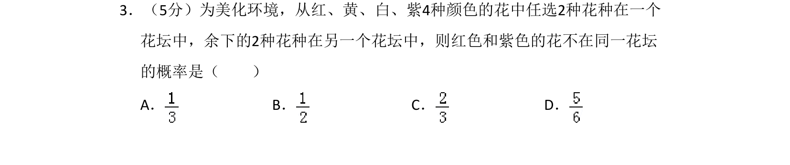
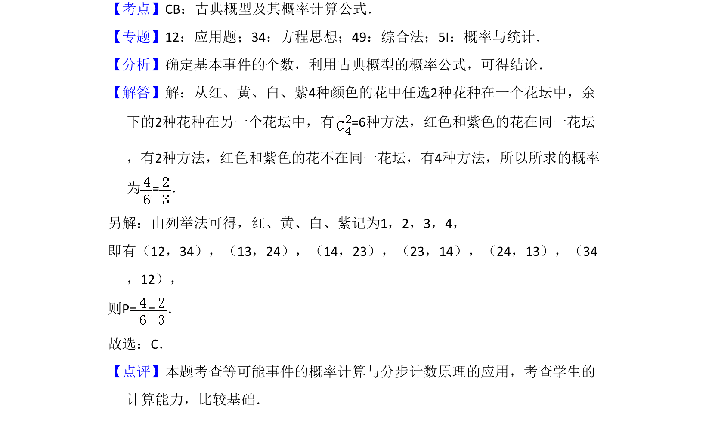

## 题面

## 摘要

从4种花中选2种分到两个花坛，求红色和紫色不在同一花坛的概率。

## 关联考点

- [[320-古典概型|古典概型]]
- [[949-概率计算公式|概率计算公式]]
- [[枚举法]]

## 答案与解析

> 📄 原 PDF 第 2 页：`素材/真题/湖南/2008-2024·（湖南）数学高考真题/2016年高考数学试卷（文）（新课标Ⅰ）（解析卷）.pdf`
