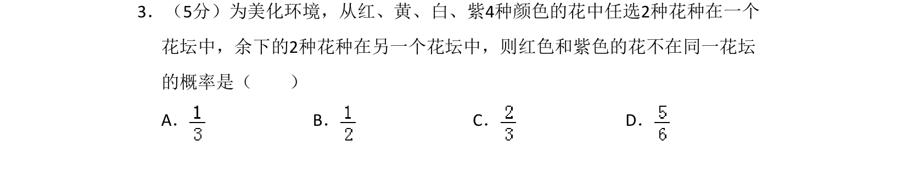
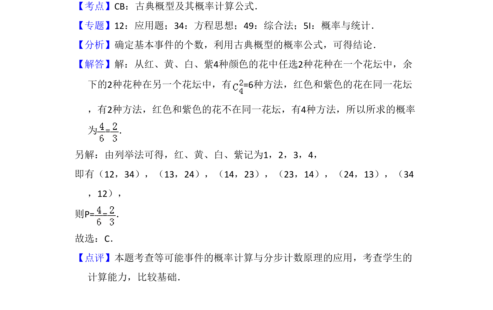

## 题面

## 摘要

从4种花中选2种分到两个花坛，求红色和紫色不在同一花坛的概率。

## 关联考点

- [[320-古典概型|古典概型]]
- [[949-概率计算公式|概率计算公式]]
- [[枚举法]]

## 答案与解析

> 📄 原 PDF 第 2 页：`素材/真题/湖南/2008-2024·（湖南）数学高考真题/2016年高考数学试卷（文）（新课标Ⅰ）（解析卷）.pdf`

<!-- 题干文本-start -->
## 题干文本
3．（5分）为美化环境，从红、黄、白、紫4种颜色的花中任选2种花种在一个
花坛中，余下的2种花种在另一个花坛中，则红色和紫色的花不在同一花坛
的概率是（　　）
A．B．C．D．
<!-- 题干文本-end -->

<!-- 解析文本-start -->
## 解析文本
【考点】CB：古典概型及其概率计算公式．菁优网版权所有
【专题】12：应用题；34：方程思想；49：综合法；5I：概率与统计．
【分析】确定基本事件的个数，利用古典概型的概率公式，可得结论．
【解答】解：从红、黄、白、紫4种颜色的花中任选2种花种在一个花坛中，余
下的2种花种在另一个花坛中，有=6种方法，红色和紫色的花在同一花坛
，有2种方法，红色和紫色的花不在同一花坛，有4种方法，所以所求的概率
为=．
另解：由列举法可得，红、黄、白、紫记为1，2，3，4，
即有（12，34），（13，24），（14，23），（23，14），（24，13），（34
，12），
则P= =．
故选：C．
【点评】本题考查等可能事件的概率计算与分步计数原理的应用，考查学生的
计算能力，比较基础．
<!-- 解析文本-end -->
