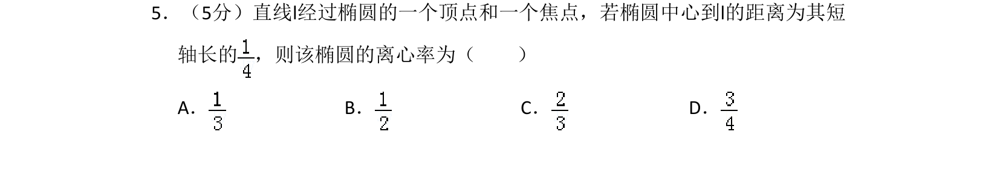
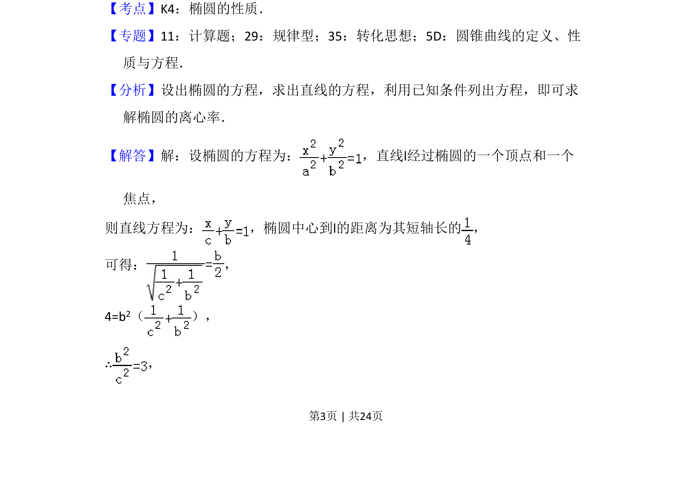
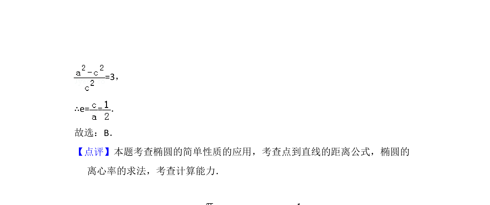

## 题面

## 摘要

求椭圆离心率，通过顶点和焦点的直线方程及椭圆中心到直线距离建立关系求解。

## 关联考点

- [[388-椭圆几何性质|椭圆性质]]
- [[1211-点到直线距离|点到直线距离]]
- [[1037-离心率计算|离心率计算]]

## 答案与解析

> 📄 原 PDF 第 3 页：`素材/真题/湖南/2008-2024·（湖南）数学高考真题/2016年高考数学试卷（文）（新课标Ⅰ）（解析卷）.pdf`
