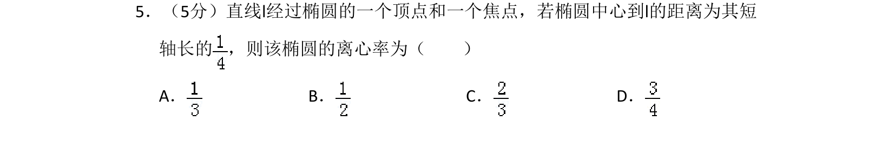
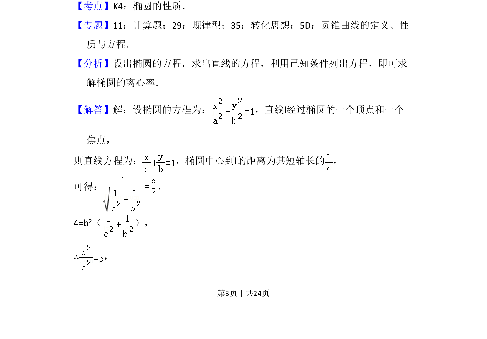
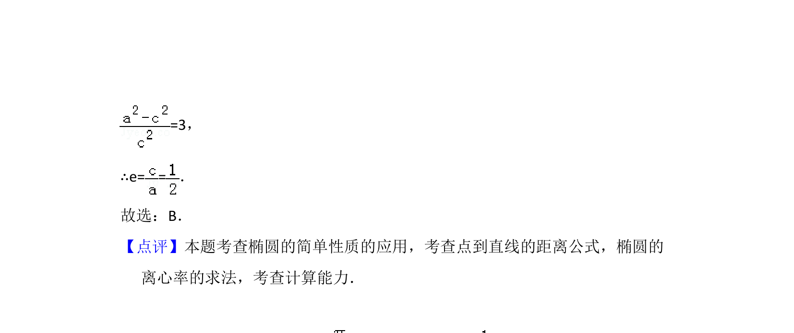

## 题面

## 摘要

求椭圆离心率，通过顶点和焦点的直线方程及椭圆中心到直线距离建立关系求解。

## 关联考点

- [[388-椭圆几何性质|椭圆性质]]
- [[1211-点到直线距离|点到直线距离]]
- [[1037-离心率计算|离心率计算]]

## 答案与解析

> 📄 原 PDF 第 3 页：`素材/真题/湖南/2008-2024·（湖南）数学高考真题/2016年高考数学试卷（文）（新课标Ⅰ）（解析卷）.pdf`

<!-- 题干文本-start -->
## 题干文本
5．（5分）直线l经过椭圆的一个顶点和一个焦点，若椭圆中心到l的距离为其短
轴长的 ，则该椭圆的离心率为（　　）
A．B．C．D．
<!-- 题干文本-end -->

<!-- 解析文本-start -->
## 解析文本
【考点】K4：椭圆的性质．菁优网版权所有
【专题】11：计算题；29：规律型；35：转化思想；5D：圆锥曲线的定义、性
质与方程．
【分析】设出椭圆的方程，求出直线的方程，利用已知条件列出方程，即可求
解椭圆的离心率．
【解答】解：设椭圆的方程为： ，直线l经过椭圆的一个顶点和一个
焦点，
则直线方程为： ，椭圆中心到l的距离为其短轴长的 ，
可得： ，
4=b2（ ），
∴，
<!-- 解析文本-end -->
