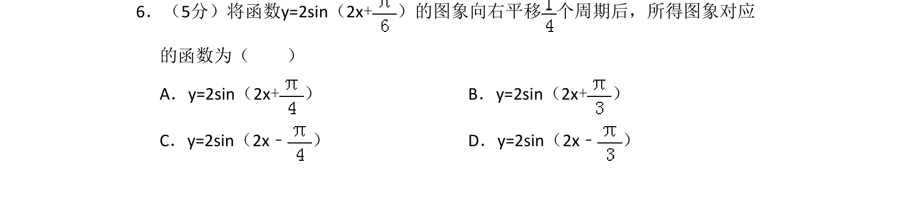
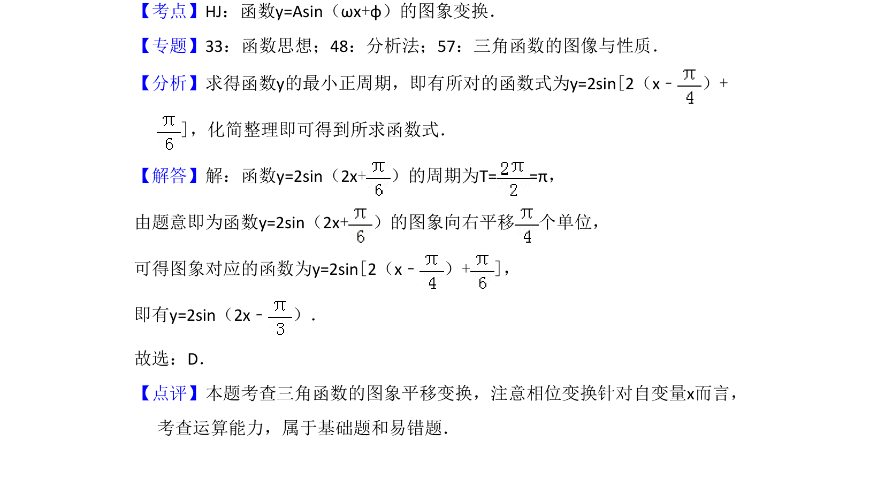

## 题面

## 摘要

将函数y=2sin(2x+φ)的图象平移，根据周期确定平移单位，利用平移法则求解新解析式。

## 关联考点

- [[673-函数y=Asin(ωx+φ)的图象变换|函数y=Asin(ωx+φ)的图象变换]]
- [[三角函数的周期]]
- [[283-函数的图象变换|图象平移]]

## 答案与解析

> 📄 原 PDF 第 4 页：`素材/真题/湖南/2008-2024·（湖南）数学高考真题/2016年高考数学试卷（文）（新课标Ⅰ）（解析卷）.pdf`
