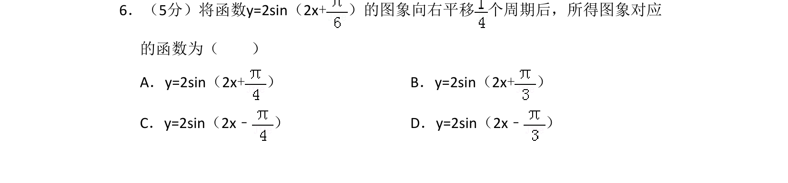
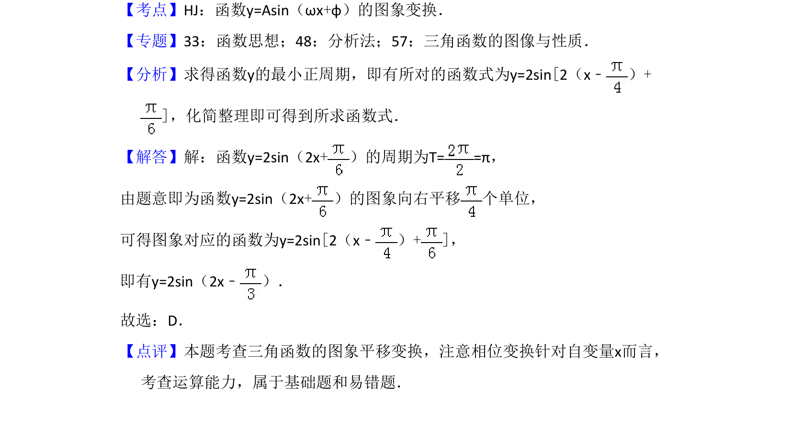

## 题面

## 摘要

将函数y=2sin(2x+φ)的图象平移，根据周期确定平移单位，利用平移法则求解新解析式。

## 关联考点

- [[673-函数y=Asin(ωx+φ)的图象变换|函数y=Asin(ωx+φ)的图象变换]]
- [[三角函数的周期]]
- [[283-函数的图象变换|图象平移]]

## 答案与解析

> 📄 原 PDF 第 4 页：`素材/真题/湖南/2008-2024·（湖南）数学高考真题/2016年高考数学试卷（文）（新课标Ⅰ）（解析卷）.pdf`

<!-- 题干文本-start -->
## 题干文本
6．（5分）将函数y=2sin（2x+）的图象向右平移 个周期后，所得图象对应
的函数为（　　）
A．y=2sin（2x+）B．y=2sin（2x+）
C．y=2sin（2x﹣ ）D．y=2sin（2x﹣ ）
<!-- 题干文本-end -->

<!-- 解析文本-start -->
## 解析文本
【考点】HJ：函数y=Asin（ωx+φ）的图象变换．菁优网版权所有
【专题】33：函数思想；48：分析法；57：三角函数的图像与性质．
【分析】求得函数y的最小正周期，即有所对的函数式为y=2sin[2（x﹣ ）+
]，化简整理即可得到所求函数式．
【解答】解：函数y=2sin（2x+）的周期为T==π，
由题意即为函数y=2sin（2x+）的图象向右平移 个单位，
可得图象对应的函数为y=2sin[2（x﹣ ）+ ]，
即有y=2sin（2x﹣ ）．
故选：D．
【点评】本题考查三角函数的图象平移变换，注意相位变换针对自变量x而言，
考查运算能力，属于基础题和易错题．
<!-- 解析文本-end -->
