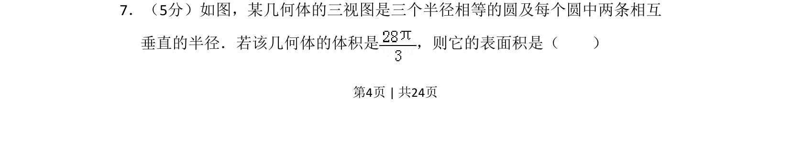
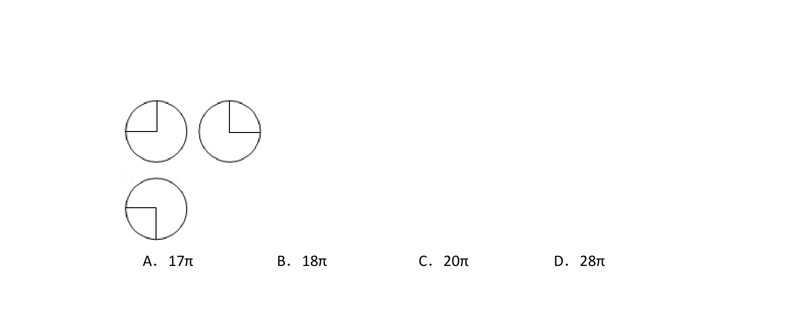
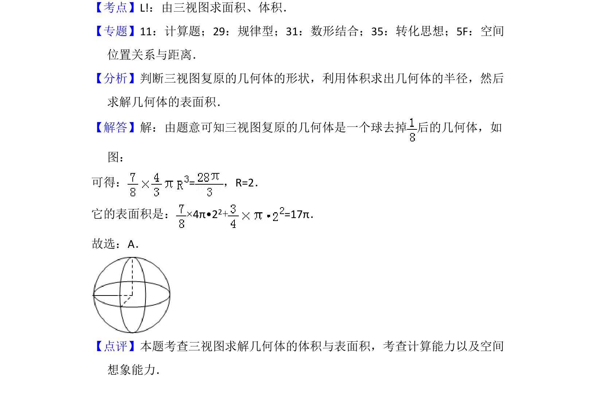

## 题面

## 摘要

根据三视图（三个半径相等且含垂直半径的圆）还原几何体为八分之一球体，结合体积求表面积。

## 关联考点

- [[235-三视图|三视图]]
- [[球的体积]]
- [[993-球的表面积|球的表面积]]
- [[1053-空间想象|空间想象]]

## 答案与解析

> 📄 原 PDF 第 4 页：`素材/真题/湖南/2008-2024·（湖南）数学高考真题/2016年高考数学试卷（文）（新课标Ⅰ）（解析卷）.pdf`
