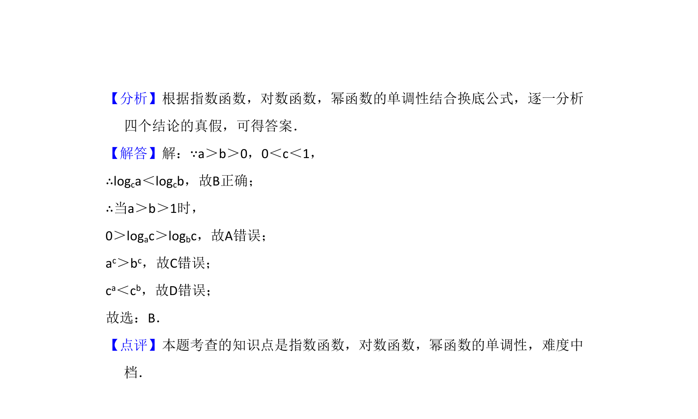

## 题面

## 摘要

本题考查对数式与指数式的大小比较，需结合对数函数和指数函数的单调性进行判断。

## 关联考点

- [[1162-对数值大小比较|对数值大小比较]]
- [[827-对数函数单调性|对数函数单调性]]
- [[553-指数函数单调性|指数函数单调性]]

## 答案与解析

> 📄 原 PDF 第 5 页：`素材/真题/湖南/2008-2024·（湖南）数学高考真题/2016年高考数学试卷（文）（新课标Ⅰ）（解析卷）.pdf`

<!-- 题干文本-start -->
## 题干文本
8．（5分）若a＞b＞0，0＜c＜1，则（　　）
A．logac＜logbc B．log ca＜logcb C．a c＜bc D．ca＞cb
<!-- 题干文本-end -->

<!-- 解析文本-start -->
## 解析文本
【考点】4M：对数值大小的比较．菁优网版权所有
【专题】35：转化思想；4R：转化法；51：函数的性质及应用．
<!-- 解析文本-end -->
