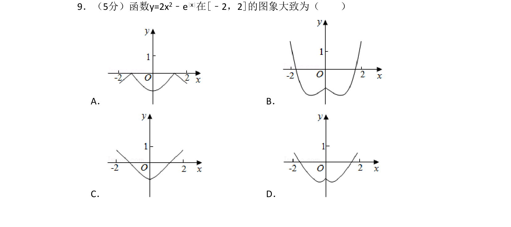
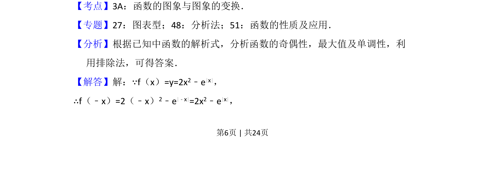
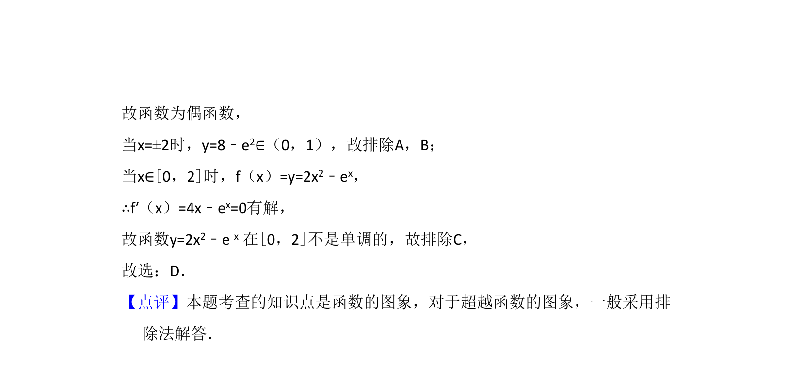

## 题面

## 摘要

根据函数解析式分析奇偶性、最值及单调性，利用排除法选择图像。

## 关联考点

- [[689-函数的图象与图象的变换|函数的图象与图象的变换]]
- [[817-奇偶性|奇偶性]]
- [[286-函数的最值|函数的最值]]
- [[719-单调性|单调性]]

## 答案与解析

> 📄 原 PDF 第 6 页：`素材/真题/湖南/2008-2024·（湖南）数学高考真题/2016年高考数学试卷（文）（新课标Ⅰ）（解析卷）.pdf`
