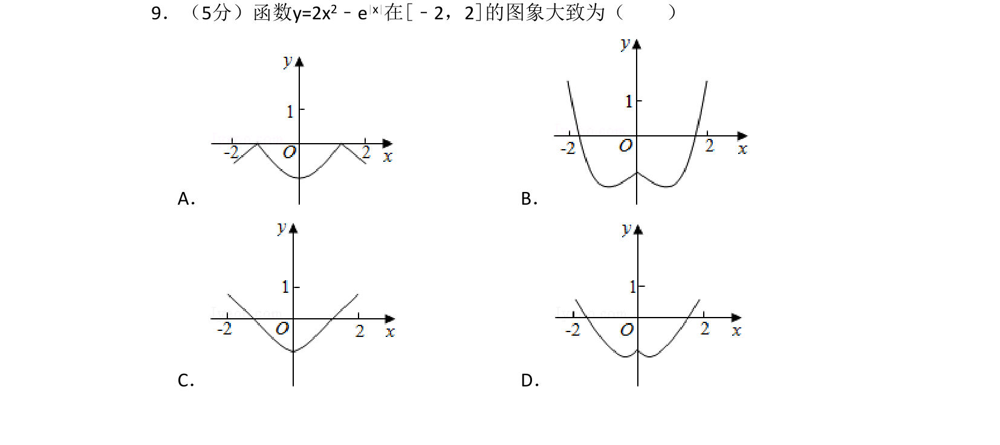
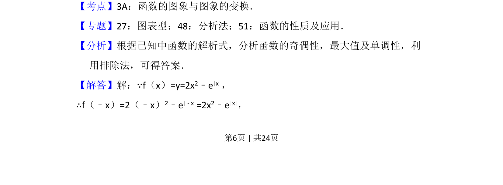
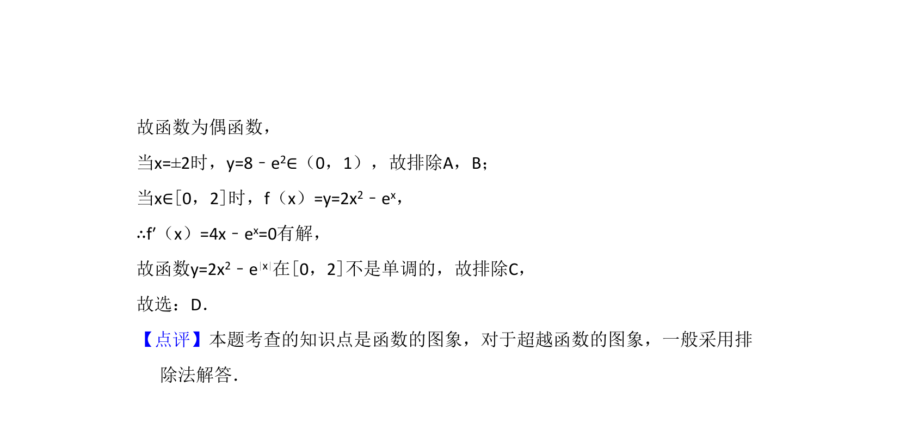

## 题面

## 摘要

根据函数解析式分析奇偶性、最值及单调性，利用排除法选择图像。

## 关联考点

- [[689-函数的图象与图象的变换|函数的图象与图象的变换]]
- [[817-奇偶性|奇偶性]]
- [[286-函数的最值|函数的最值]]
- [[719-单调性|单调性]]

## 答案与解析

> 📄 原 PDF 第 6 页：`素材/真题/湖南/2008-2024·（湖南）数学高考真题/2016年高考数学试卷（文）（新课标Ⅰ）（解析卷）.pdf`

<!-- 题干文本-start -->
## 题干文本
9．（5分）函数y=2x2﹣e|x|在[﹣2，2]的图象大致为（　　）
A．B．
C．D．
<!-- 题干文本-end -->

<!-- 解析文本-start -->
## 解析文本
【考点】3A：函数的图象与图象的变换．菁优网版权所有
【专题】27：图表型；48：分析法；51：函数的性质及应用．
【分析】根据已知中函数的解析式，分析函数的奇偶性，最大值及单调性，利
用排除法，可得答案．
【解答】解：∵f（x）=y=2x2﹣e|x|，
∴f（﹣x）=2（﹣x）2﹣e|﹣x|=2x2﹣e|x|，
<!-- 解析文本-end -->
