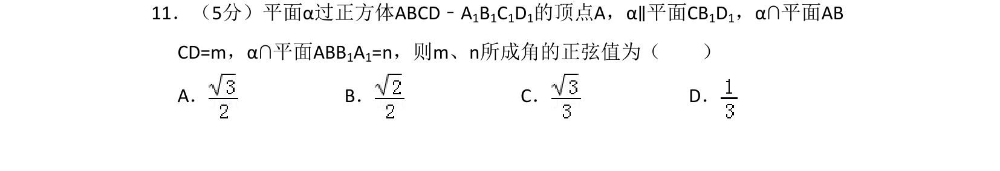
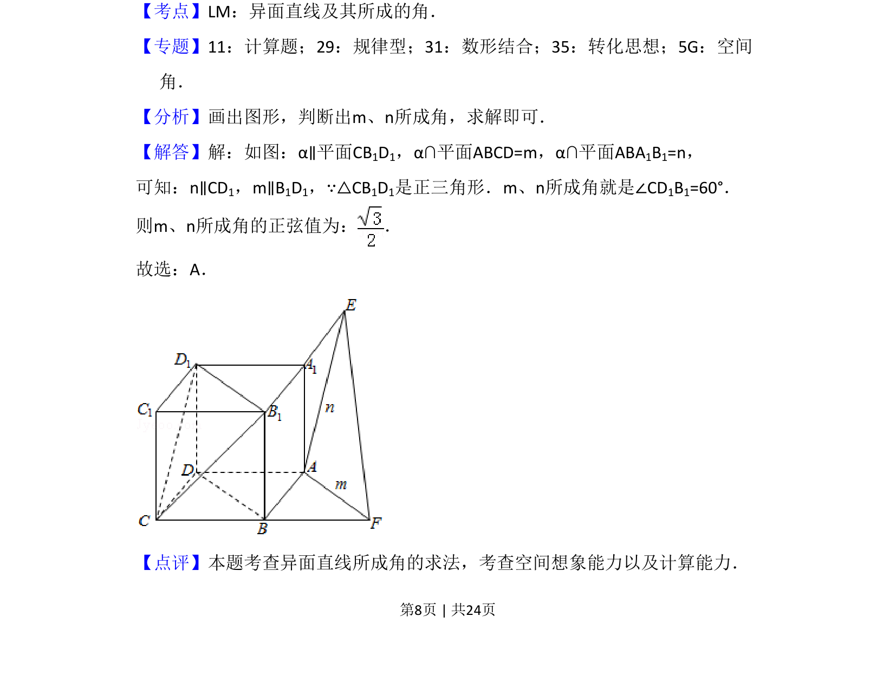

## 题面

## 摘要

平面α平行于正方体对角面，转化为求异面直线m与n所成角的正弦值。

## 关联考点

- [[862-异面直线及其所成的角|异面直线及其所成的角]]
- [[1054-空间想象能力|空间想象能力]]
- [[1125-转化思想|转化思想]]

## 答案与解析

> 📄 原 PDF 第 8 页：`素材/真题/湖南/2008-2024·（湖南）数学高考真题/2016年高考数学试卷（文）（新课标Ⅰ）（解析卷）.pdf`

<!-- 题干文本-start -->
## 题干文本
11．（5分）平面α过正方体ABCD﹣A1B1C1D1的顶点A，α∥平面CB1D1，α∩平面AB
CD=m，α∩平面ABB1A1=n，则m、n所成角的正弦值为（　　）
A．B．C．D．
<!-- 题干文本-end -->

<!-- 解析文本-start -->
## 解析文本
【考点】LM：异面直线及其所成的角．菁优网版权所有
【专题】11：计算题；29：规律型；31：数形结合；35：转化思想；5G：空间
角．
【分析】画出图形，判断出m、n所成角，求解即可．
【解答】解：如图：α∥平面CB1D1，α∩平面ABCD=m，α∩平面ABA1B1=n，
可知：n∥CD1，m∥B1D1，∵△CB1D1是正三角形．m、n所成角就是∠CD1B1=60°．
则m、n所成角的正弦值为： ．
故选：A．
【点评】本题考查异面直线所成角的求法，考查空间想象能力以及计算能力．
<!-- 解析文本-end -->
