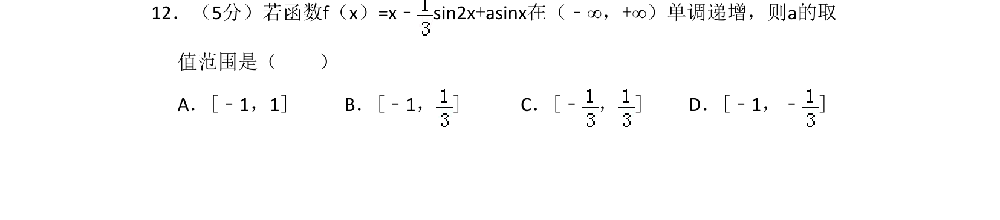
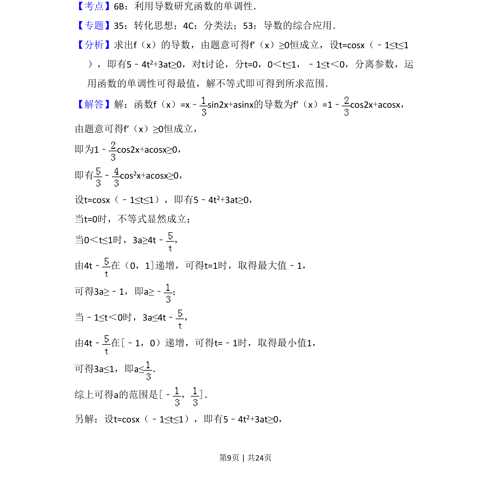
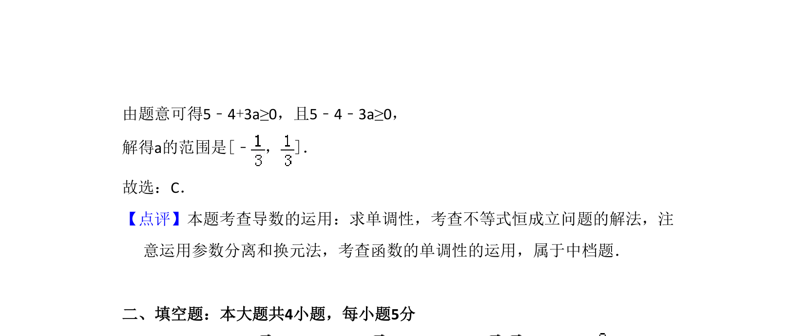

## 题面

## 摘要

函数单调递增求参数范围，通过导数恒成立转化为不等式恒成立，利用换元及分类讨论求解。

## 关联考点

- [[705-利用导数研究函数的单调性|利用导数研究函数的单调性]]
- [[450-恒成立问题|恒成立问题]]
- [[885-换元思想|换元法]]
- [[424-参数分类讨论|分类讨论]]

## 答案与解析

> 📄 原 PDF 第 9 页：`素材/真题/湖南/2008-2024·（湖南）数学高考真题/2016年高考数学试卷（文）（新课标Ⅰ）（解析卷）.pdf`
