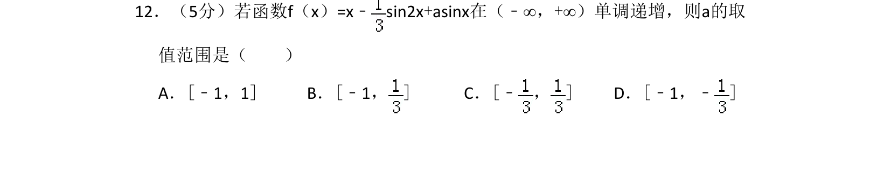
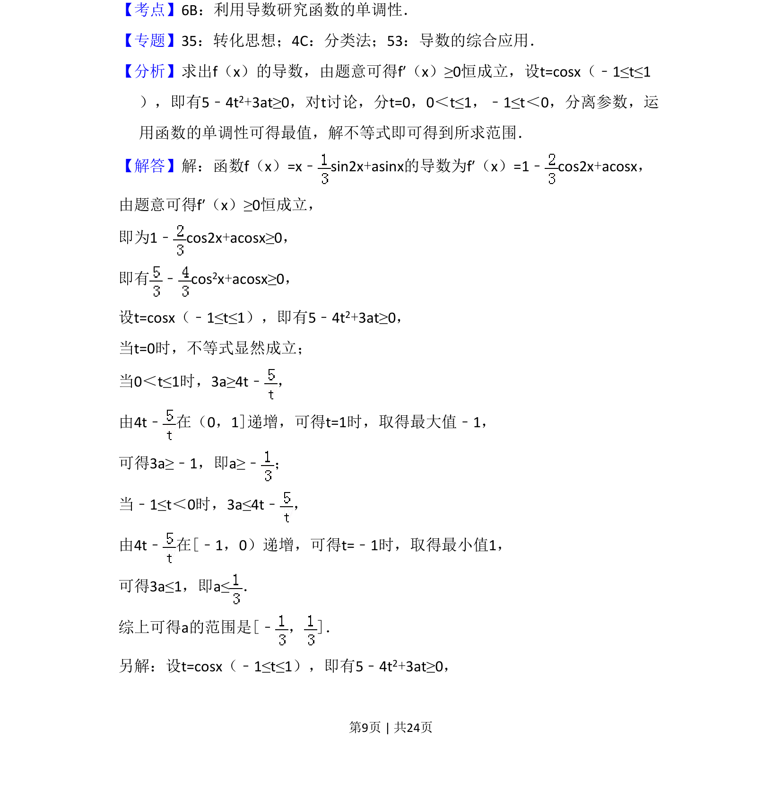
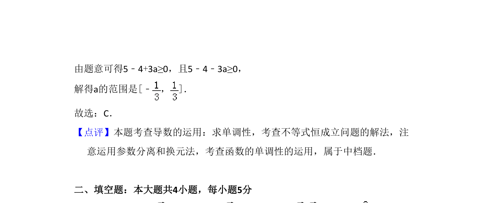

## 题面

## 摘要

函数单调递增求参数范围，通过导数恒成立转化为不等式恒成立，利用换元及分类讨论求解。

## 关联考点

- [[705-利用导数研究函数的单调性|利用导数研究函数的单调性]]
- [[450-恒成立问题|恒成立问题]]
- [[885-换元思想|换元法]]
- [[424-参数分类讨论|分类讨论]]

## 答案与解析

> 📄 原 PDF 第 9 页：`素材/真题/湖南/2008-2024·（湖南）数学高考真题/2016年高考数学试卷（文）（新课标Ⅰ）（解析卷）.pdf`

<!-- 题干文本-start -->
## 题干文本
12．（5分）若函数f（x）=x﹣sin2x+asinx在（﹣∞，+∞）单调递增，则a的取
值范围是（　　）
A．[﹣1，1]B．[﹣1，]C．[﹣ ，]D．[﹣1，﹣]
<!-- 题干文本-end -->

<!-- 解析文本-start -->
## 解析文本
【考点】6B：利用导数研究函数的单调性．菁优网版权所有
【专题】35：转化思想；4C：分类法；53：导数的综合应用．
【分析】求出f（x）的导数，由题意可得f′（x）≥0恒成立，设t=cosx（﹣1≤t≤1
），即有5﹣4t2+3at≥0，对t讨论，分t=0，0＜t≤1，﹣1≤t＜0，分离参数，运
用函数的单调性可得最值，解不等式即可得到所求范围．
【解答】解：函数f（x）=x﹣sin2x+asinx的导数为f′（x）=1﹣cos2x+acosx，
由题意可得f′（x）≥0恒成立，
即为1﹣cos2x+acosx≥0，
即有 ﹣cos 2x+acosx≥0，
设t=cosx（﹣1≤t≤1），即有5﹣4t2+3at≥0，
当t=0时，不等式显然成立；
当0＜t≤1时，3a≥4t﹣ ，
由4t﹣ 在（0，1]递增，可得t=1时，取得最大值﹣1，
可得3a≥﹣1，即a≥﹣ ；
当﹣1≤t＜0时，3a≤4t﹣ ，
由4t﹣ 在[﹣1，0）递增，可得t=﹣1时，取得最小值1，
可得3a≤1，即a≤．
综上可得a的范围是[﹣ ，]．
另解：设t=cosx（﹣1≤t≤1），即有5﹣4t2+3at≥0，
<!-- 解析文本-end -->
