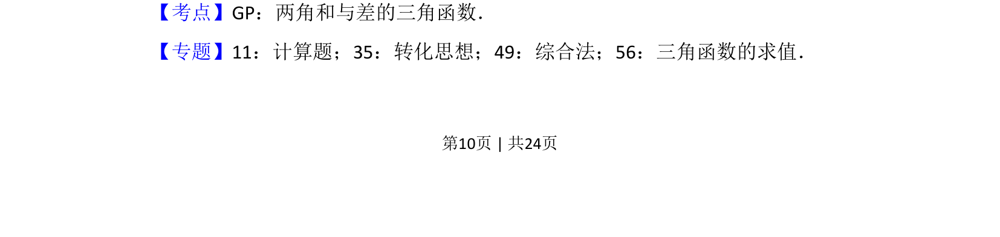
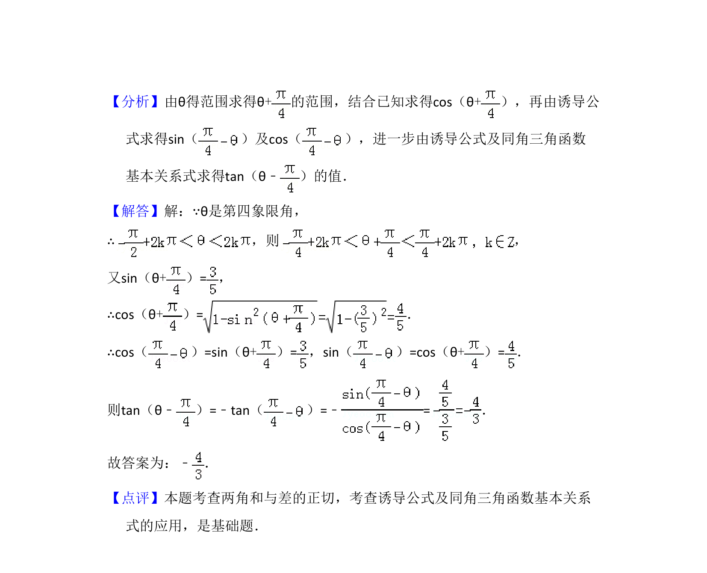

## 题面

## 摘要

已知第四象限角和正弦值，求差角的正切值。

## 关联考点

- [[628-两角和与差的三角函数|两角和与差的三角函数]]
- [[741-同角三角函数基本关系|同角三角函数基本关系]]
- [[象限角符号]]

## 答案与解析

> 📄 原 PDF 第 10 页：`素材/真题/湖南/2008-2024·（湖南）数学高考真题/2016年高考数学试卷（文）（新课标Ⅰ）（解析卷）.pdf`
