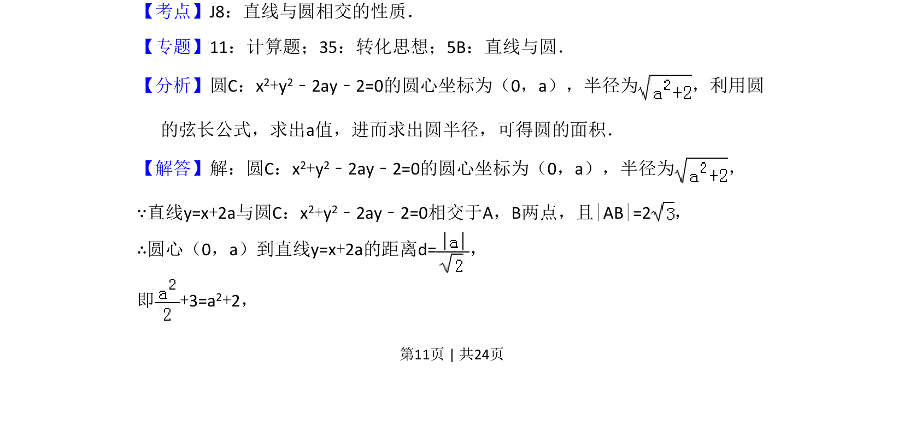
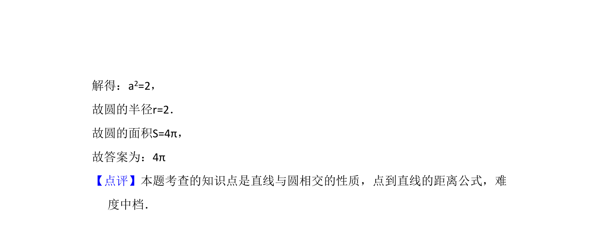

## 题面

## 摘要

直线与圆相交，给定弦长求圆的面积，涉及弦长公式和点到直线距离计算。

## 关联考点

- [[直线与圆相交性质]]
- [[867-弦长公式|弦长公式]]
- [[1211-点到直线距离|点到直线距离]]
- [[373-圆的标准方程|圆的标准方程]]

## 答案与解析

> 📄 原 PDF 第 11 页：`素材/真题/湖南/2008-2024·（湖南）数学高考真题/2016年高考数学试卷（文）（新课标Ⅰ）（解析卷）.pdf`
