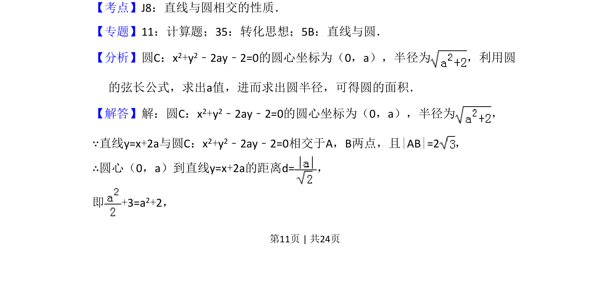
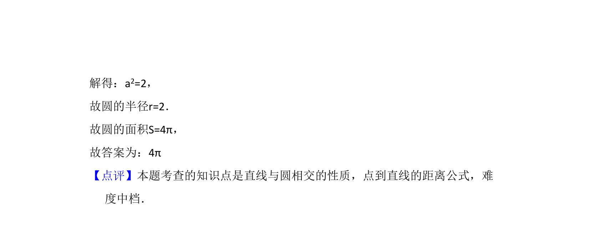

## 题面

## 摘要

直线与圆相交，给定弦长求圆的面积，涉及弦长公式和点到直线距离计算。

## 关联考点

- [[直线与圆相交性质]]
- [[867-弦长公式|弦长公式]]
- [[1211-点到直线距离|点到直线距离]]
- [[373-圆的标准方程|圆的标准方程]]

## 答案与解析

> 📄 原 PDF 第 11 页：`素材/真题/湖南/2008-2024·（湖南）数学高考真题/2016年高考数学试卷（文）（新课标Ⅰ）（解析卷）.pdf`

<!-- 题干文本-start -->
## 题干文本
15．（5分）设直线y=x+2a与圆C：x2+y2﹣2ay﹣2=0相交于A，B两点，若|AB|=2
，则圆C的面积为　4π　．
<!-- 题干文本-end -->

<!-- 解析文本-start -->
## 解析文本
【考点】J8：直线与圆相交的性质．菁优网版权所有
【专题】11：计算题；35：转化思想；5B：直线与圆．
【分析】圆C：x2+y2﹣2ay﹣2=0的圆心坐标为（0，a），半径为 ，利用圆
的弦长公式，求出a值，进而求出圆半径，可得圆的面积．
【解答】解：圆C：x2+y2﹣2ay﹣2=0的圆心坐标为（0，a），半径为 ，
∵直线y=x+2a与圆C：x2+y2﹣2ay﹣2=0相交于A，B两点，且|AB|=2，
∴圆心（0，a）到直线y=x+2a的距离d=，
即+3=a 2+2，
<!-- 解析文本-end -->
