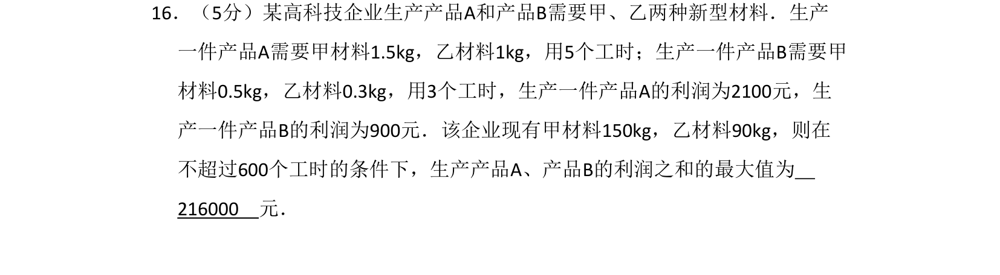
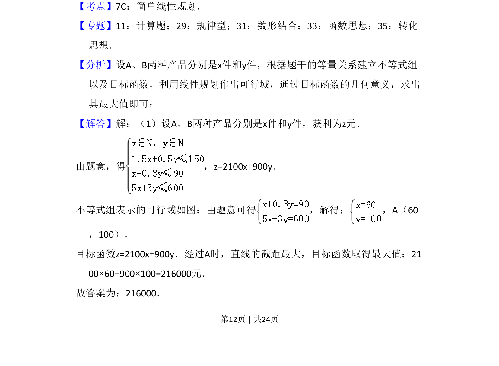
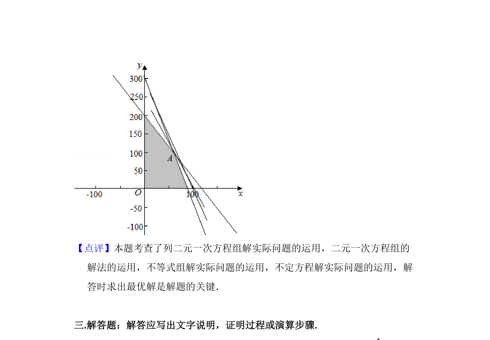

## 题面

## 摘要

该题考查线性规划在实际生产优化问题中的应用，需要建立约束与目标函数模型并求解最值。

## 关联考点

- [[1074-简单线性规划|线性规划]]
- [[1417-约束条件|约束条件]]
- [[999-目标函数|目标函数]]
- [[1156-可行域|可行域]]

## 答案与解析

> 📄 原 PDF 第 12 页：`素材/真题/湖南/2008-2024·（湖南）数学高考真题/2016年高考数学试卷（文）（新课标Ⅰ）（解析卷）.pdf`
