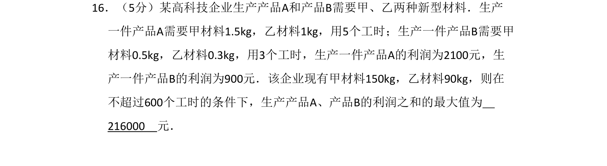
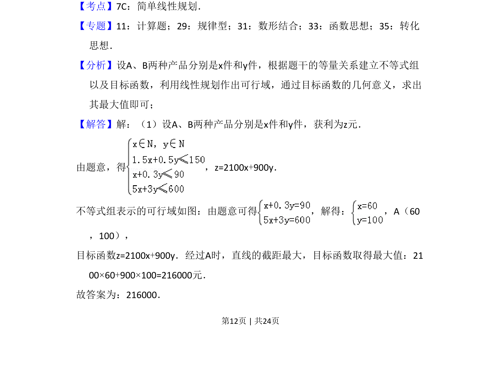
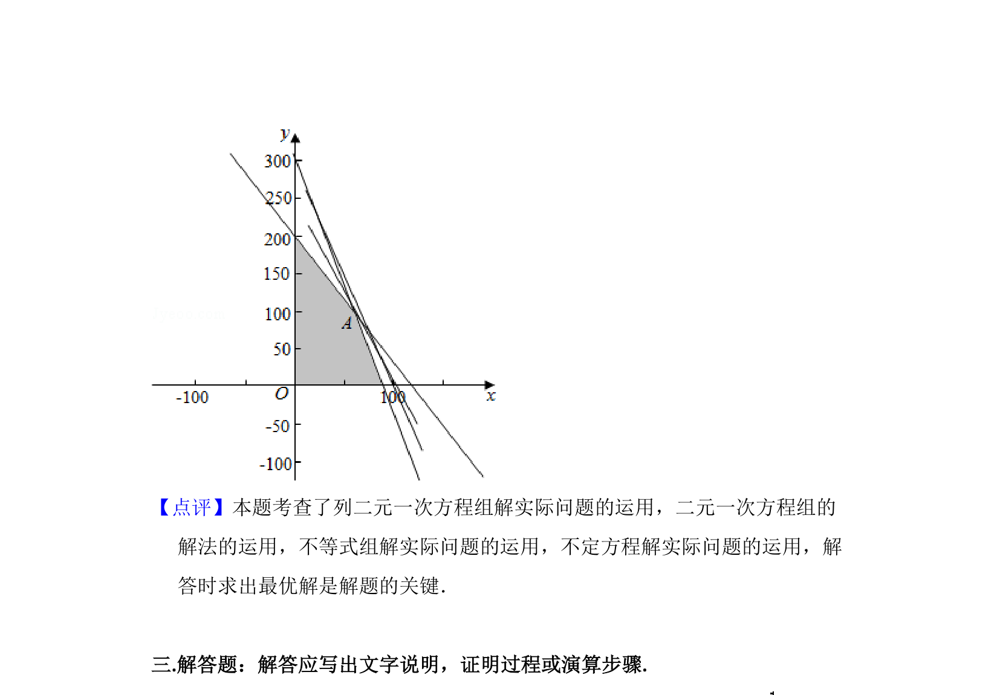

## 题面

## 摘要

该题考查线性规划在实际生产优化问题中的应用，需要建立约束与目标函数模型并求解最值。

## 关联考点

- [[1074-简单线性规划|线性规划]]
- [[1417-约束条件|约束条件]]
- [[999-目标函数|目标函数]]
- [[1156-可行域|可行域]]

## 答案与解析

> 📄 原 PDF 第 12 页：`素材/真题/湖南/2008-2024·（湖南）数学高考真题/2016年高考数学试卷（文）（新课标Ⅰ）（解析卷）.pdf`

<!-- 题干文本-start -->
## 题干文本
16．（5分）某高科技企业生产产品A和产品B需要甲、乙两种新型材料．生产
一件产品A需要甲材料1.5kg，乙材料1kg，用5个工时；生产一件产品B需要甲
材料0.5kg，乙材料0.3kg，用3个工时，生产一件产品A的利润为2100元，生
产一件产品B的利润为900元．该企业现有甲材料150kg，乙材料90kg，则在
不超过600个工时的条件下，生产产品A、产品B的利润之和的最大值为　
216000　元．
<!-- 题干文本-end -->

<!-- 解析文本-start -->
## 解析文本
【考点】7C：简单线性规划．菁优网版权所有
【专题】11：计算题；29：规律型；31：数形结合；33：函数思想；35：转化
思想．
【分析】设A、B两种产品分别是x件和y件，根据题干的等量关系建立不等式组
以及目标函数，利用线性规划作出可行域，通过目标函数的几何意义，求出
其最大值即可；
【解答】解：（1）设A、B两种产品分别是x件和y件，获利为z元．
由题意，得 ，z=2100x+900y．
不等式组表示的可行域如图：由题意可得 ，解得： ，A（60
，100），
目标函数z=2100x+900y．经过A时，直线的截距最大，目标函数取得最大值：21
00×60+900×100=216000元．
故答案为：216000．
<!-- 解析文本-end -->
