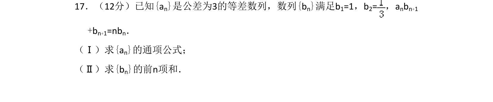
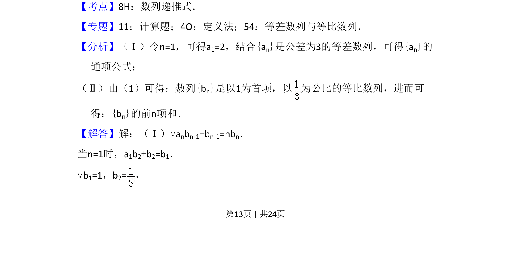
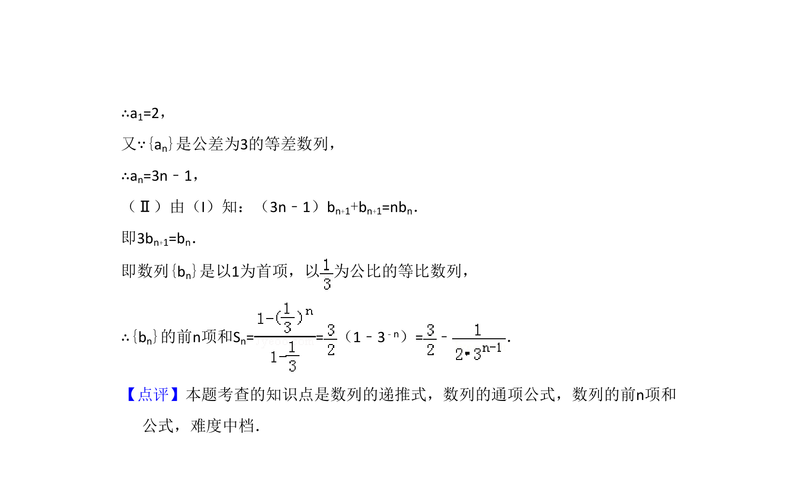

## 题面

## 摘要

等差数列通项公式及由递推关系求等比数列前n项和

## 关联考点

- [[894-数列递推式|数列递推式]]
- [[356-等差数列概念|等差数列]]
- [[1067-等比数列的定义与通项公式|等比数列]]
- [[355-等差数列前n项和|前n项和]]

## 答案与解析

> 📄 原 PDF 第 13 页：`素材/真题/湖南/2008-2024·（湖南）数学高考真题/2016年高考数学试卷（文）（新课标Ⅰ）（解析卷）.pdf`
