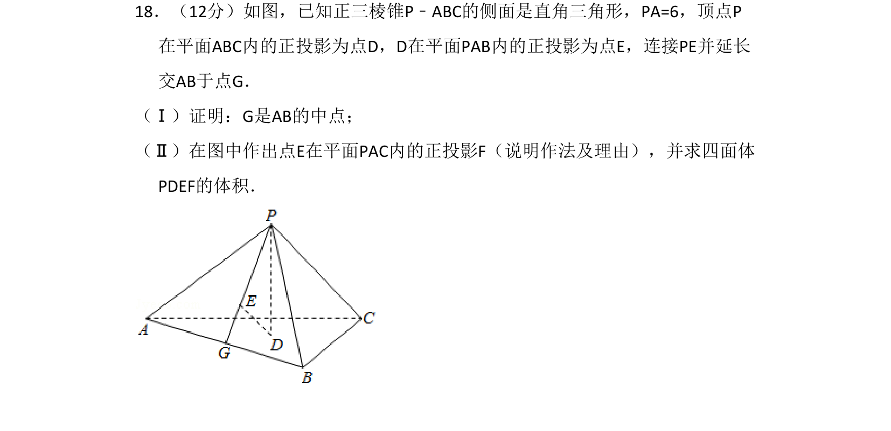
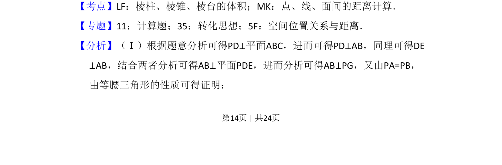
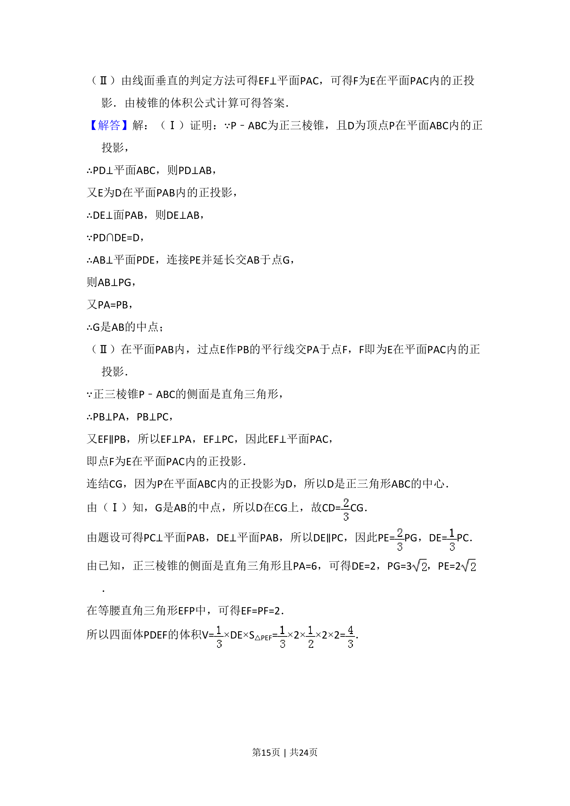
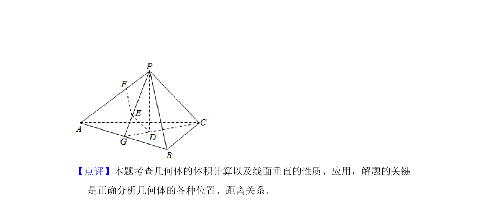

## 题面

## 摘要

正三棱锥中利用垂直关系和正投影证明中点，并作出点投影求四面体体积

## 关联考点

- [[936-棱锥体积|棱锥体积]]
- [[点线面间距离]]
- [[350-空间点直线平面位置关系|空间位置关系]]
- [[251-正投影|正投影]]

## 答案与解析

> 📄 原 PDF 第 14 页：`素材/真题/湖南/2008-2024·（湖南）数学高考真题/2016年高考数学试卷（文）（新课标Ⅰ）（解析卷）.pdf`
