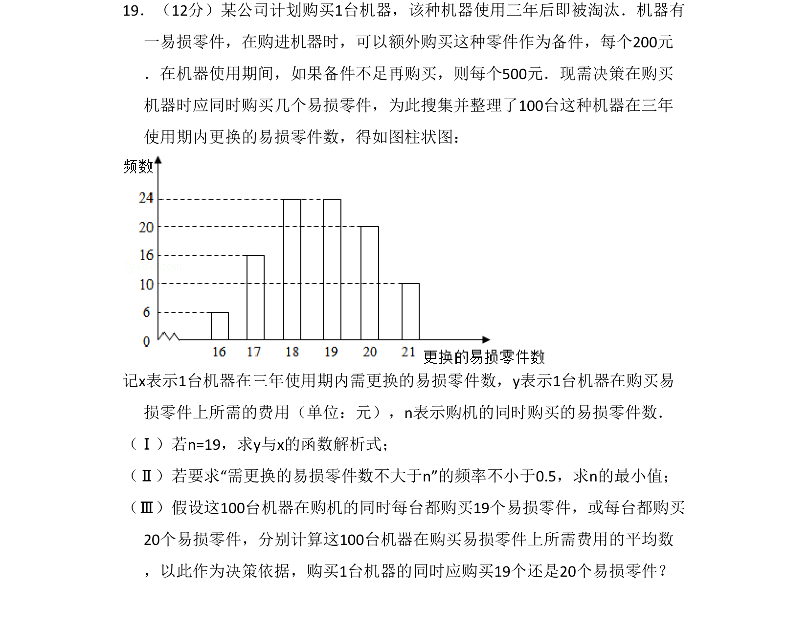
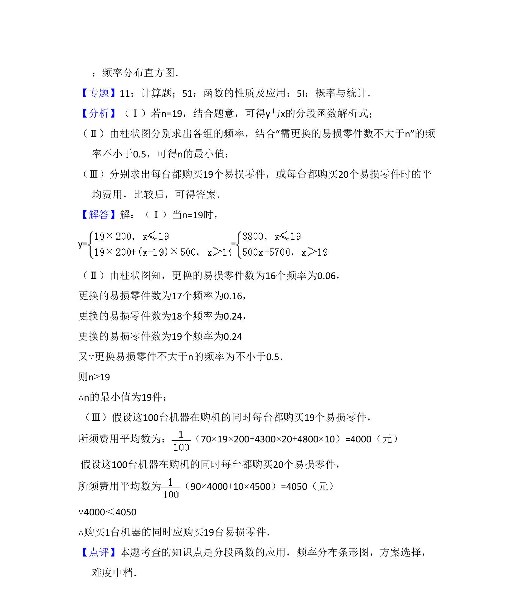

## 题面

## 摘要

该题考查根据实际更换零件数据建立分段函数模型，并基于频率分布与费用平均数进行购买决策。

## 关联考点

- [[1369-分段函数模型|分段函数模型]]
- [[143-频数分布|频率分布]]
- [[055-平均数|平均数]]
- [[最优决策]]

## 答案与解析

> 📄 原 PDF 第 16 页：`素材/真题/湖南/2008-2024·（湖南）数学高考真题/2016年高考数学试卷（文）（新课标Ⅰ）（解析卷）.pdf`
