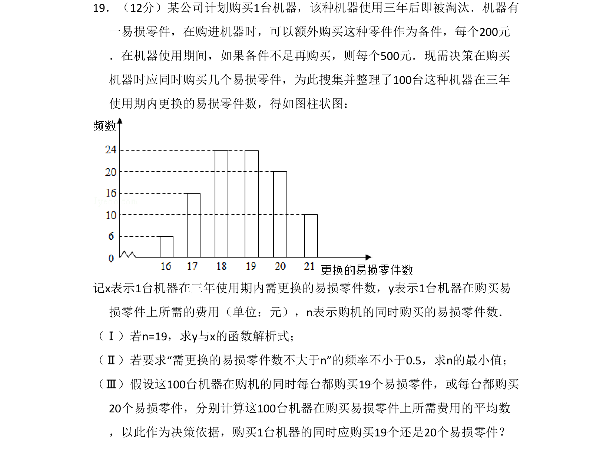
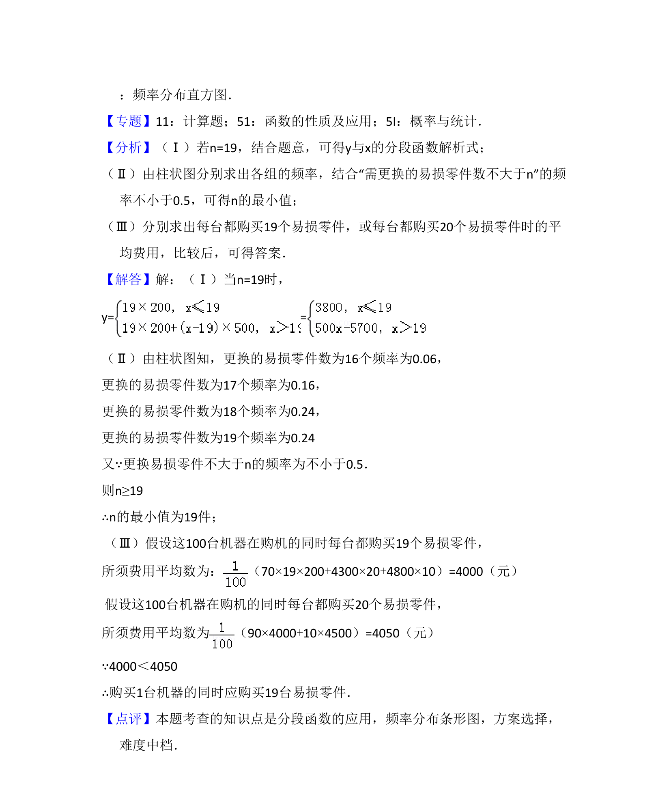

## 题面

## 摘要

该题考查根据实际更换零件数据建立分段函数模型，并基于频率分布与费用平均数进行购买决策。

## 关联考点

- [[1369-分段函数模型|分段函数模型]]
- [[143-频数分布|频率分布]]
- [[055-平均数|平均数]]
- [[最优决策]]

## 答案与解析

> 📄 原 PDF 第 16 页：`素材/真题/湖南/2008-2024·（湖南）数学高考真题/2016年高考数学试卷（文）（新课标Ⅰ）（解析卷）.pdf`

<!-- 题干文本-start -->
## 题干文本
19．（12分）某公司计划购买1台机器，该种机器使用三年后即被淘汰．机器有
一易损零件，在购进机器时，可以额外购买这种零件作为备件，每个200元
．在机器使用期间，如果备件不足再购买，则每个500元．现需决策在购买
机器时应同时购买几个易损零件，为此搜集并整理了100台这种机器在三年
使用期内更换的易损零件数，得如图柱状图：
记x表示1台机器在三年使用期内需更换的易损零件数，y表示1台机器在购买易
损零件上所需的费用（单位：元），n表示购机的同时购买的易损零件数．
（Ⅰ）若n=19，求y与x的函数解析式；
（Ⅱ）若要求“需更换的易损零件数不大于n”的频率不小于0.5，求n的最小值；
（Ⅲ）假设这100台机器在购机的同时每台都购买19个易损零件，或每台都购买
20个易损零件，分别计算这100台机器在购买易损零件上所需费用的平均数
，以此作为决策依据，购买1台机器的同时应购买19个还是20个易损零件？
<!-- 题干文本-end -->

<!-- 解析文本-start -->
## 解析文本
【考点】3H：函数的最值及其几何意义；5C：根据实际问题选择函数类型；B8
<!-- 解析文本-end -->
