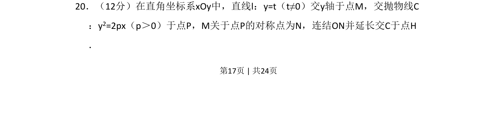
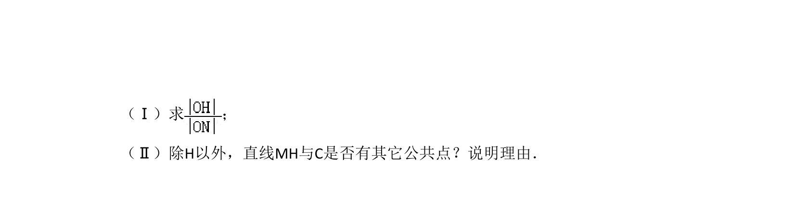
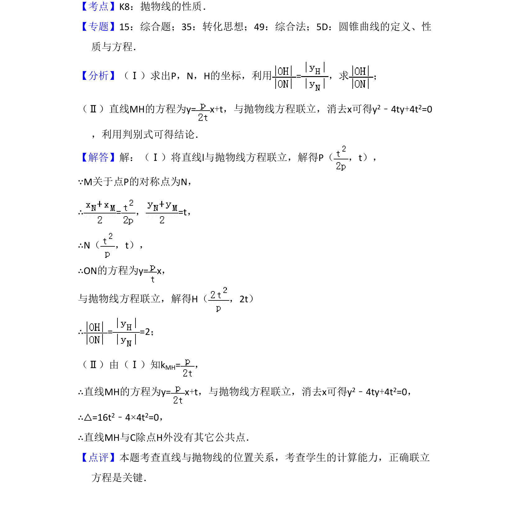

## 题面

## 摘要

已知直线与抛物线交点及对称关系，求抛物线上另一交点。

## 关联考点

- [[227-抛物线|抛物线]]
- [[中点坐标]]
- [[1026-直线方程|直线方程]]
- [[对称点]]

## 答案与解析

> 📄 原 PDF 第 17 页：`素材/真题/湖南/2008-2024·（湖南）数学高考真题/2016年高考数学试卷（文）（新课标Ⅰ）（解析卷）.pdf`
